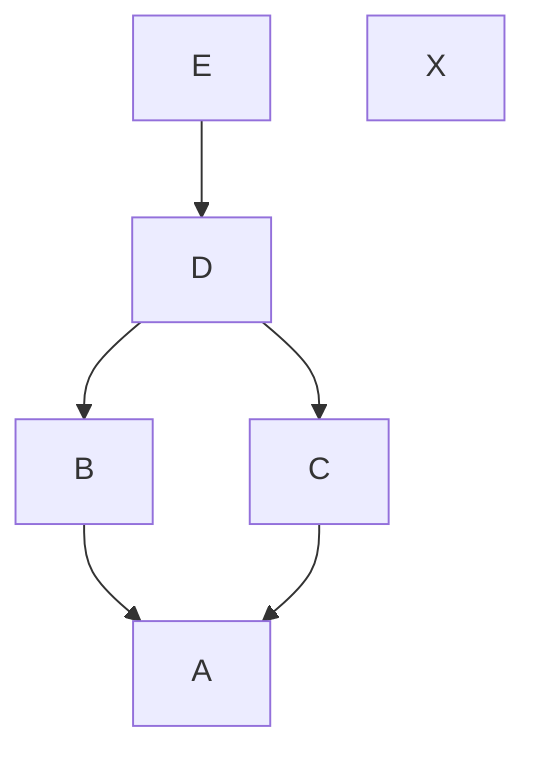

# B5-2 그래프 학습 안내서 — 파이썬의 값부터 LOG와 PATH까지

이 문서는 그래프를 처음 배우는 사람을 위한 학습 자료다. 현재 작성한 코드에서 출발해서, 각 변수가 무엇을 담고 있고 반복문을 한 번 실행할 때 무엇이 바뀌는지 설명한다.

기능의 근거는 [Subject.txt](Subject.txt) 3장·4장·7장이다. 현재 구현은 [graph.py](../graph.py), [Commit](../commit.py), [Repository](../repository.py)를 기준으로 읽는다. 진행 상황은 [CHECK.md](CHECK.md), 과제 전체의 개념 요약은 [Study.md](Study.md), 평가 질문은 [evaluate.txt](evaluate.txt)를 참고한다.

이 문서는 **학습 문서**다. 이미 있는 두 그래프 함수는 실제 코드를 설명하고, 아직 구현하지 않은 기능은 개념·실행 표·의사코드로 설명한다. 의사코드는 동작 순서를 적은 설명이며 그대로 실행하는 Python 코드가 아니다. 새 기능을 구현했다는 뜻도 아니다.

## 읽는 순서와 현재 위치

현재 `graph.py`에 함수가 두 개 있다고 해서 그래프와 관련된 모든 요구사항이 완료된 것은 아니다.

| 대상 | 현재 상태 | 앞으로 이해할 내용 |
| --- | --- | --- |
| `find_ancestors()` | 구현·기능 검증 완료. 현재는 BFS 방식이다. | ID로 객체를 찾고, 부모 방향으로 모든 조상을 수집하는 원리 |
| `build_children_map()` | 구현·기능 검증 완료 | 부모 목록을 읽어 부모 → 직접 자식 목록을 만드는 원리 |
| 기본 LOG의 순서 구성 | 아직 구현할 부분 | 모든 부모를 먼저 처리하는 위상 정렬 |
| PATH | 아직 구현할 부분 | 무방향 연결, 최단 거리, 경로 복원, 사전순 동률 처리 |
| 저장소·CLI와 연결 | 이후 단계에서 연결 | 계산 결과를 커밋 정보로 바꾸고 화면에 출력하는 과정 |

함수 이름이나 보조 함수의 수는 구현 선택이다. 명세가 요구하는 것은 기능과 알고리즘 분리다.

추천하는 읽기 순서는 다음과 같다. 한 번에 끝내기보다, 예제의 다음 줄을 실행하기 전에 값이 어떻게 바뀔지 직접 적어 본다.

| 순서 | 읽을 부분 | 다음으로 가기 전에 할 수 있어야 하는 것 |
| --- | --- | --- |
| 1 | 1~3절 | 문자열 ID, 객체, 딕셔너리, 리스트, 집합을 구분한다. |
| 2 | 4~6절 | 같은 그래프를 부모·자식·무방향으로 읽는다. |
| 3 | 7~10절 | 지금 구현된 두 함수를 한 줄씩 설명한다. |
| 4 | 11절 | 부모 수를 줄여 LOG 순서를 만드는 과정을 손으로 실행한다. |
| 5 | 12~13절 | 최단 거리와 실제 경로를 구분하고 동률 규칙을 이해한다. |
| 6 | 14~18절 | 비용·연결 구조·평가 질문을 설명하고 연습문제를 푼다. |

목차:

- [1. 값, 객체, 변수, 타입 힌트](#s01)
- [2. 리스트·집합·딕셔너리](#s02)
- [3. 반복문과 함수의 실행](#s03)
- [4. 그래프 용어와 공통 예제](#s04)
- [5. Repository·HEAD·부모 관계](#s05)
- [6. 같은 연결을 세 방향으로 읽기](#s06)
- [7. 스택·큐·DFS·BFS](#s07)
- [8. 발견과 처리, 중복 방지](#s08)
- [9. find_ancestors 전체 해설](#s09)
- [10. build_children_map 전체 해설](#s10)
- [11. 부모 우선 LOG와 위상 정렬](#s11)
- [12. PATH의 거리와 경로 복원](#s12)
- [13. 최단 경로의 사전순 동률 처리](#s13)
- [14. 시간복잡도와 자료구조 비용](#s14)
- [15. 그래프 함수와 프로그램 연결](#s15)
- [16. 실제로 헷갈렸던 코드 다시 읽기](#s16)
- [17. 평가의 조건 변경 질문](#s17)
- [18. 직접 풀어 보는 문제와 해설](#s18)

<a id="s01"></a>

## 1. 값, 객체, 변수, 타입 힌트

### 1.1 커밋 ID와 커밋 객체는 다른 것이다

`"CI_0"`은 문자열이다. 커밋을 식별하는 이름표 역할을 하지만, 그 문자열 자체에 메시지나 부모 목록이 들어 있지는 않다.

`Commit` 객체는 실제 정보를 묶어 보관한다.

```text
커밋 ID 문자열: "CI_0"

Commit 객체:
    hash      = "CI_0"
    message   = "Initial commit"
    author    = "Alice"
    timestamp = 생성 시각
    parents   = []
```

따라서 다음 두 표현은 다르다.

```python
commit_id = "CI_0"
commit = commits[commit_id]
```

첫 줄의 변수에는 문자열이 연결된다. 두 번째 줄에서는 문자열을 **딕셔너리의 키로 사용해서** 그 ID의 `Commit` 객체를 꺼낸다.

| 표현 | 실제로 얻는 것 |
| --- | --- |
| `commit_id` | 문자열 `"CI_0"` |
| `commits[commit_id]` | 해당 `Commit` 객체 |
| `commits[commit_id].parents` | 그 객체의 부모 ID 리스트 |

문자열에는 `.parents`가 없다. 객체를 먼저 꺼낸 다음 그 속성을 읽어야 한다.

### 1.2 같은 ID가 두 곳에 있는 이유

현재 `store_commit()`은 다음 관계를 만든다.

```python
self.commits[commit.hash] = commit
```

딕셔너리의 키와 객체의 `hash` 속성에 같은 ID가 들어간다.

```text
commits의 키 "CI_0"
    └─ 가리키는 Commit 객체의 hash도 "CI_0"
```

키는 객체를 찾는 데 쓰고, 객체의 `hash`는 객체를 다른 함수에 전달했을 때도 자신의 ID를 알 수 있게 한다. 현재 `Commit`의 생성자 매개변수 이름은 `commit_hash`, 실제 속성 이름은 `hash`다.

```python
self.hash = commit_hash
```

### 1.3 타입 힌트는 값이나 객체를 자동으로 만들지 않는다

```python
commits: dict[str, Commit]
```

이는 “키가 문자열이고 값이 Commit 객체인 딕셔너리로 사용하겠다”는 설명이다. 앞의 `str`에 작성자 이름이 들어간다는 뜻은 아니다. 이 프로그램에서는 커밋 ID가 키다.

```python
parents: list[str]
```

이는 “문자열들을 담은 리스트”라는 뜻이다. 문자열 하나와 문자열 하나를 담은 리스트는 다르다.

```python
"CI_0"       # str
["CI_0"]     # list[str]
[]           # 빈 리스트
```

또한 함수에 `-> set[str]`이라고 적어도 Python이 반환값을 자동으로 집합으로 바꾸지는 않는다. 실행되는 `return`이 없으면 일반 함수는 `None`을 반환한다. 타입 힌트와 실제 실행 결과를 함께 확인해야 한다.

타입 표기를 읽는 법과 실제 객체에 접근하는 법이 아직 낯설다면, 아래 2.8~2.11절을 함께 읽는다. 특히 `str`이라는 타입 이름과 `"A"`라는 실제 문자열 값을 구분하는 것이 출발점이다.

### 1.4 변수에 다시 대입하는 것과 원본 객체를 바꾸는 것

다음 코드를 단계별로 읽어 보자.

```python
branches = {"main": "CI_0"}
parents = branches["main"]
parents = [parents]
```

| 실행 후 | `parents` | `branches` |
| --- | --- | --- |
| 두 번째 줄 | `"CI_0"` | `{"main": "CI_0"}` |
| 세 번째 줄 | `["CI_0"]` | `{"main": "CI_0"}` |

`parents`는 딕셔너리의 칸 자체에 붙인 별명이 아니다. 그 칸에서 꺼낸 객체를 참조하는 별도의 변수다. 세 번째 줄은 새 리스트를 만들고 `parents`라는 이름을 그 리스트에 연결한다. 딕셔너리의 칸은 바꾸지 않는다.

반면 딕셔너리의 값을 바꾸려면 그 칸에 직접 대입한다.

```python
branches["main"] = "CI_1"
```

오른쪽을 먼저 계산하고 왼쪽에 대입한다는 점도 중요하다.

```python
parents = [parents]
```

오른쪽에서 기존 `parents`인 `"CI_0"`을 읽고, `["CI_0"]`을 만든 뒤, 왼쪽 변수에 다시 저장한다.

### 1.5 같은 리스트를 공유하면 내용 변경은 함께 보일 수 있다

```python
original = ["A", "B"]
shared = original
shared.pop()
```

이때 `original`도 `["A"]`이 된다. 두 변수가 같은 리스트 객체를 참조하기 때문이다. `.pop()`은 그 객체의 내용을 바꾼다.

탐색용 리스트를 따로 만들면 원본을 보존할 수 있다.

```python
original = ["A", "B"]
work = list(original)
work.pop()
```

이제 `work`는 `["A"]`, `original`은 `["A", "B"]`다. 현재 `parents`는 문자열 ID들의 리스트이므로, 별도의 리스트를 만드는 것으로 원본 목록에 대한 추가·삭제를 피할 수 있다.

**확인 질문:** `parent_list = list(start_commit.parents)`에서 왜 `list(...)`를 사용했는지 설명할 수 있는가?

<a id="s02"></a>

## 2. 리스트·집합·딕셔너리

자료구조는 데이터를 어떤 규칙으로 담고 꺼낼지 정한 구조다. 이번 그래프 기능에서는 아래 세 가지가 반복해서 나온다.

| 자료구조 | 중요한 특징 | 이번 과제의 용도 |
| --- | --- | --- |
| 리스트 `list` | 순서가 있고 중복을 허용한다. | 부모 목록, 처리 대기 목록, 로그 순서, 실제 경로 |
| 집합 `set` | 같은 원소를 중복 보관하지 않는다. 원소 순서를 보장하지 않는다. | 발견한 조상, 방문 기록, 역색인의 ID 묶음 |
| 딕셔너리 `dict` | 키로 값을 찾는다. | ID → 객체, 부모 → 자식들, ID → 거리, ID → 직전 노드 |

### 2.1 비어 있는 자료구조의 표기

```python
items = []       # 빈 리스트
seen = set()     # 빈 집합
mapping = {}     # 빈 딕셔너리
```

`set()`은 단순히 이름 없는 공간만 예약하는 것이 아니다. 값의 중복을 관리하는 집합 객체를 만든다. `{}`는 빈 집합이 아니라 빈 딕셔너리다.

### 2.2 리스트에 하나 넣기, 여러 개 넣기, 꺼내기

```python
waiting = ["B"]
waiting.append("C")       # ["B", "C"]
item = waiting.pop()      # item은 "C", waiting은 ["B"]
```

`.append(x)`는 x를 **원소 하나**로 추가한다. x가 리스트라면 리스트가 한 원소로 들어간다.

```python
waiting = []
waiting.append(["B", "C"])
# [["B", "C"]] : 안에 리스트가 들어 있는 리스트
```

여러 ID를 각각 넣고 싶다면 하나씩 추가하거나 `.extend()`를 사용할 수 있다.

```python
waiting = []
waiting.extend(["B", "C"])
# ["B", "C"]
```

현재 그래프 함수의 처리 대기 목록에는 **각 원소가 문자열 ID**로 들어가야 한다. `["B", "C"]`를 ID 하나처럼 딕셔너리 키로 쓰려고 하면 문제가 생긴다.

### 2.3 문자열을 리스트로 바꾸는 두 표현의 차이

```python
list("CI_0")    # ["C", "I", "_", "0"]
["CI_0"]        # ["CI_0"]
```

`list(...)`는 전달된 대상을 순회해 그 원소들을 새 리스트에 담는다. 문자열을 순회하면 글자가 하나씩 나오기 때문에 첫 번째 결과는 글자 목록이다.

반면 `list(["B", "C"])`는 기존 리스트의 원소인 두 ID를 새 리스트에 담는다. `find_ancestors()`의 `list(start_commit.parents)`가 바로 이 경우다.

### 2.4 자료구조를 바꾸는 메서드의 반환값

```python
waiting = []
result = waiting.append("A")
```

이후 `waiting`은 `["A"]`이고 `result`는 `None`이다. `.append()`는 기존 리스트를 변경하고, 변경된 리스트를 반환하지는 않는다.

따라서 다음처럼 쓰면 `waiting`을 잃어버린다.

```python
waiting = waiting.append("B")
# 오른쪽 호출은 리스트를 변경하지만 None을 반환한다.
# 그 None이 왼쪽 waiting에 대입된다.
```

`.pop()`은 다르다. 기존 리스트에서 원소를 제거하면서 **꺼낸 원소를 반환**한다.

### 2.5 집합에 추가하고 포함 여부를 확인하기

```python
found = set()
found.add("A")
found.add("A")
# 원소는 "A" 하나다.
```

```python
"A" in found       # True
"B" not in found   # True
```

집합은 “앞으로 처리할 순서”를 보관하기보다, “이미 발견했는가?”를 확인하는 용도로 적합하다. 실제 경로나 로그 순서처럼 순서가 결과의 일부이면 리스트를 사용해야 한다.

### 2.6 딕셔너리의 키, 값, 키-값 쌍

```python
commits = {"A": a_commit, "B": b_commit}
```

위 표현에서 `a_commit`, `b_commit`은 이미 만들어진 Commit 객체라고 가정한다.

| 반복 표현 | 한 번에 받는 것 |
| --- | --- |
| `for commit_id in commits:` | `"A"`, `"B"` 같은 키 |
| `for commit_id in commits.keys():` | 위와 같은 키 |
| `for commit in commits.values():` | Commit 객체 |
| `for commit_id, commit in commits.items():` | ID와 객체의 쌍 |

`.items()`의 두 변수는 한 쌍을 나누어 받는다. 왼쪽 변수에는 ID, 오른쪽 변수에는 객체가 들어간다.

```python
if commit_hash in commits:
    commit = commits[commit_hash]
```

`in`은 키가 있는지 확인한다. `commits[commit_hash]`는 그 키의 값을 꺼낸다. 키가 없을 때 딕셔너리에 직접 접근하면 `KeyError`가 발생한다. 현재 프로그램의 일부 함수는 그 전에 존재 여부를 확인해서 `ValueError`로 안내하고 있다.

**ID가 같은지 비교한다고 문자열이 객체로 변하지 않는다.**

```python
for commit_id in commits:
    if commit_id == commit_hash:
        # 여기서도 commit_id는 문자열이다.
        ...
```

찾을 ID를 이미 알고 있다면 전체를 돌며 비교할 필요 없이 해당 키로 조회하면 된다.

### 2.7 딕셔너리 안의 리스트는 별도의 객체다

```python
children = {"A": [], "B": []}
children["A"].append("B")
```

결과는 `{"A": ["B"], "B": []}`다. `children["A"]`로 A의 리스트를 꺼낸 뒤 그 리스트에 B라는 문자열을 넣은 것이다.

중요한 점은 **리스트의 원소와 딕셔너리의 키가 별개**라는 것이다.

```python
children = {"A": []}
children["A"].append("B")
# {"A": ["B"]}
```

이 코드가 `"B": []`라는 딕셔너리 항목까지 자동으로 만들지는 않는다.

또한 서로 다른 키의 빈 리스트는 각각 만들어야 한다. 같은 리스트를 여러 키에 연결하면 한쪽에 추가한 내용이 다른 키에서도 보인다.

```python
shared = []
children = {"A": shared, "B": shared}
children["A"].append("C")
# A와 B가 같은 리스트를 공유하므로 두 키에서 모두 ["C"]가 보인다.
```

현재 `build_children_map()`은 반복할 때마다 `[]`를 새로 만들므로 각 커밋의 목록이 분리된다.

### 2.8 `dict[str, list[str]]`를 안쪽과 바깥쪽으로 나누어 읽기

한 번에 전체를 외우려고 하지 말고, 가장 바깥 자료구조부터 읽는다.

```text
dict[ str, list[str] ]
  │    │      │
  │    │      └─ 값은 "문자열들을 담은 리스트"
  │    └──────── 키는 문자열
  └───────────── 전체는 딕셔너리
```

`dict[키의 타입, 값의 타입]`이 기본 틀이다. 값의 타입 자리에 단순한 `str` 대신 `list[str]`이라는 설명이 들어간 것이다.

안쪽의 `list[str]`는 “리스트이고, 그 원소들은 문자열이다”라고 읽는다.

다음 실제 값을 놓고 타입을 대응시켜 보자.

```python
children: dict[str, list[str]] = {
    "A": ["B", "C"],
    "B": ["D"],
    "C": ["D"],
    "D": [],
}
```

| 실제 부분 | 타입 표기에서 대응하는 부분 | 설명 |
| --- | --- | --- |
| 바깥 `{...}` 전체 | `dict[...]` | 키로 값을 찾는 딕셔너리 |
| `"A"`, `"B"`, `"C"`, `"D"` | 첫 번째 `str` | 딕셔너리의 키 |
| `["B", "C"]`, `["D"]`, `[]` | `list[str]` | 각 키에 연결된 값 |
| 리스트 안의 `"B"`, `"C"`, `"D"` | 리스트 안쪽의 `str` | 리스트의 개별 원소 |

`"A"`는 문자열이지만 `["A"]`는 리스트다. 리스트 안에 문자열이 들어 있다고 리스트 자체도 문자열이 되는 것은 아니다.

빈 리스트 `[]`도 이 구조에서 사용할 수 있다. “여기에 문자열 원소들을 보관하며, 지금은 0개다”라는 상태다.

아래 한 줄도 역할을 나누어 읽을 수 있다.

```python
children: dict[str, list[str]] = {}
```

| 부분 | 역할 |
| --- | --- |
| `children` | 변수 이름 |
| `: dict[str, list[str]]` | 이 변수를 어떤 타입으로 사용할지 설명 |
| `= {}` | 실제 빈 딕셔너리를 만들고 변수에 연결하는 실행 |

타입 설명만 적는 것과 값을 만드는 것은 다르다. `children: dict[str, list[str]]`만 적었다고 자식 목록들이 자동으로 생성되지는 않는다. 어떤 키를 넣을지, 각 키에 어떤 리스트를 연결할지는 실제 실행 코드가 정한다.

### 2.9 `commits: dict[str, Commit]`에서 값은 무엇인가

이번에는 값이 리스트가 아니라 **직접 정의한 클래스의 객체**다.

```text
commits: dict[ str, Commit ]
                    │
                    └─ 각 값은 Commit 클래스로 만든 객체
```

`Commit`은 커밋 객체에 어떤 정보를 보관할지 정의한 클래스 이름이다. `Commit(...)`을 호출하면 그 정의에 따라 실제 객체 하나가 만들어진다.

```python
# 앞서 만든 a_commit, b_commit이 실제 Commit 객체라고 가정한다.
commits = {
    "A": a_commit,
    "B": b_commit,
}
```

이 딕셔너리는 다음처럼 이해할 수 있다.

```text
키 "A" ──→ Commit 객체 하나
              hash = "A"
              message = "Commit A"
              author = "Alice"
              parents = []

키 "B" ──→ 다른 Commit 객체 하나
              hash = "B"
              message = "Commit B"
              author = "Alice"
              parents = ["A"]
```

`dict[str, Commit]`이라고 해서 값 자리에 문자열 `"Commit"`을 넣는 것이 아니다. 클래스 이름 자체인 `Commit`을 각 값으로 넣는다는 뜻도 아니다. **`Commit(...)`으로 만든 실제 커밋 객체들**을 보관한다는 뜻이다.

객체는 정보를 묶어서 보관하며, 속성 이름으로 읽는다. 이 프로그램에서는 `commit.hash`, `commit.message`, `commit.parents` 등이 그 접근이다. `Commit` 클래스 내부가 딕셔너리와 같은 사용법을 자동으로 제공하는 것은 아니므로 `commit["parents"]`처럼 접근하지 않는다.

타입 표기 자체는 키가 반드시 객체의 `.hash`와 같아야 한다는 규칙까지 실행해서 보장하지 않는다. 그 일치는 현재 `store_commit()`의 `self.commits[commit.hash] = commit`이라는 코드로 지킨다.

### 2.10 접근할 때마다 타입이 어떻게 바뀌는가

4절의 공통 예제와 위의 자식 표를 기준으로 읽는다.

| 표현 | 얻는 값 | 얻는 값의 타입 |
| --- | --- | --- |
| `commits` | 전체 커밋 저장소 | `dict[str, Commit]` |
| `commits["B"]` | B 커밋 객체 | `Commit` |
| `commits["B"].hash` | `"B"` | `str` |
| `commits["B"].parents` | `["A"]` | `list[str]` |
| `commits["B"].parents[0]` | `"A"` | `str` |
| `commits[commits["B"].parents[0]]` | A 커밋 객체 | `Commit` |

마지막 표현이 복잡하게 느껴지면 중간 변수로 나눈다.

```python
b_commit = commits["B"]
parent_ids = b_commit.parents
first_parent_id = parent_ids[0]
a_commit = commits[first_parent_id]
```

이 예제는 B에게 부모가 있어서 `[0]`을 읽을 수 있다. 부모 없는 A의 빈 리스트에서 `[0]`을 읽으면 `IndexError`가 발생한다. 실제 탐색에서는 부모 수가 0개일 수 있으므로 부모 리스트를 순회한다.

자식 표를 읽을 때도 같은 식으로 층을 나눈다.

| 표현 | 얻는 값 | 타입 |
| --- | --- | --- |
| `children` | 전체 자식 표 | `dict[str, list[str]]` |
| `children["A"]` | `["B", "C"]` | `list[str]` |
| `children["A"][0]` | `"B"` | `str` |
| `commits[children["A"][0]]` | B 커밋 객체 | `Commit` |

따라서 `children["A"].parents`는 잘못된 접근이다. `children["A"]`는 Commit 객체가 아니라 리스트다. 그래프 코드를 읽다가 막히면 **바로 왼쪽 표현의 결과가 어떤 타입인지**부터 적어 본다.

### 2.11 앞으로 등장할 타입 표기 모아 읽기

| 표기 | 평범한 말로 읽기 | 실제 값의 예 |
| --- | --- | --- |
| `str` | 문자열 하나 | `"A"` |
| `Commit` | 커밋 객체 하나 | A의 ID·메시지·부모 등을 가진 객체 |
| `list[str]` | 순서 있게 담은 문자열들 | `["A", "B"]` |
| `set[str]` | 중복 없이 담은 문자열들 | `{"A", "B"}` |
| `dict[str, Commit]` | 문자열 키로 커밋 객체를 찾는 표 | `{"A": a_commit}` |
| `dict[str, list[str]]` | 문자열 키로 문자열 리스트를 찾는 표 | `{"A": ["B", "C"]}` |
| `dict[str, set[str]]` | 문자열 키로 문자열 집합을 찾는 표 | `{"Alice": {"A", "B"}}` |
| `dict[str, int]` | 문자열 키로 정수를 찾는 표 | `{"A": 0, "B": 1}` |
| `str \| None` | 문자열 또는 값 없음 표시 | `"A"` 또는 `None` |
| `dict[str, str \| None]` | 문자열 키에 문자열이나 None을 연결한 표 | `{"main": "A", "feature": None}` |

같은 `dict[str, int]`라도 문맥에 따라 값의 뜻은 달라진다. PATH에서는 거리가 될 수 있고, 위상 정렬에서는 아직 처리되지 않은 부모 수가 될 수 있다. **타입은 값의 종류를 말하고, 변수 이름과 알고리즘은 값의 의미를 말한다.**

브랜치 표에서 `"feature": None`은 feature라는 키가 존재하면서 아직 커밋이 없다는 뜻이다. feature라는 키 자체가 없는 상태와 다르다. 부모 없는 커밋은 부모 목록 `[]`로 표현한다. `None`과 빈 리스트를 같은 것으로 바꾸어 생각하지 않는다.

<a id="s03"></a>

## 3. 반복문과 함수의 실행

### 3.1 반복문은 대상에 들어 있는 원소만 처리한다

```python
for parent_id in commit.parents:
    ...
```

부모가 `["A", "B"]`라면 두 번 실행된다. 부모가 `[]`라면 **한 번도 실행되지 않는다.**

“커밋 자체를 살펴봤으니 부모 반복문도 한 번은 실행되겠지”라고 생각하면 안 된다. 바깥 반복문과 안쪽 반복문의 실행 횟수는 각각의 대상에 달려 있다.

### 3.2 중첩 반복문을 읽는 순서

```python
for commit in commits.values():
    for parent_id in commit.parents:
        ...
```

1. 첫 Commit 객체를 꺼낸다.
2. 그 객체의 부모 ID들을 모두 처리한다.
3. 다음 Commit 객체를 꺼낸다.
4. 그 객체의 부모 ID들을 처리한다.

안쪽 반복문이 하는 일은 “현재 객체의 부모 수”만큼 반복된다. 바깥 반복문이 있다고 무조건 전체 커밋 수만큼 안쪽도 도는 것은 아니다.

### 3.3 `while waiting:`의 뜻

Python에서 빈 리스트는 조건식에서 거짓, 원소가 있는 리스트는 참으로 취급된다.

```python
while waiting:
    ...
```

따라서 이는 “처리할 항목이 남아 있는 동안 반복한다”는 뜻으로 쓸 수 있다. 한 번 꺼낸 뒤 새 항목을 추가할 수 있기 때문에, 탐색 시작 시의 목록 길이만큼만 반복하는 방식과 다르다.

### 3.4 `return`은 결과를 돌려주고 그 호출을 끝낸다

```python
result = find_ancestors(commits, "D")
```

함수에서 `return parent_set`을 실행하면 그 집합이 호출한 쪽의 `result`에 연결된다. 반환 뒤의 실행문은 실행되지 않는다.

출력과 반환은 다르다. `print()`는 화면에 보여 주고, `return`은 다른 코드가 사용할 값을 넘긴다. 현재 그래프 함수는 데이터를 반환하고 화면 출력은 이후 CLI에서 담당하도록 구성한다.

### 3.5 재귀 호출을 했다고 결과가 저절로 합쳐지지는 않는다

재귀는 함수가 자신을 다시 호출하는 방식이다. 새 호출은 별도의 지역 변수를 가진다.

```python
find_ancestors(commits, parent_id)
```

위 호출만 적으면 반환된 결과를 저장하거나 합치는 동작은 없다. 재귀로 작성하려면 무엇을 반환하고 어떻게 합칠지, 언제 끝날지, 방문 기록을 어떻게 공유할지 설계해야 한다.

현재 구현은 리스트로 처리할 항목들을 관리하는 반복 방식이다. 같은 목적을 위해 재귀와 반복 방식을 모두 구현할 필요는 없다.

<a id="s04"></a>

## 4. 그래프 용어와 공통 예제

**근거: Subject.txt 4장 「커밋 그래프」.**

그래프는 **대상들과 그 사이의 연결**을 표현한다. 이 과제에서는 대상이 커밋이고, 연결은 커밋과 부모의 관계다.

| 용어 | 이 과제에서의 의미 |
| --- | --- |
| 노드, 정점 | 커밋 하나 |
| 간선 | 커밋과 부모 사이의 연결 하나 |
| 방향 | 어느 쪽으로 이동할 수 있는지 |
| 이웃 | 간선 하나로 직접 연결된 노드 |
| 경로 | 연결을 따라 이동한 노드들의 나열 |
| 경로 길이 | 이번 PATH에서는 지나간 간선 수 |
| 도달 가능 | 허용된 방향의 간선을 따라 해당 노드에 갈 수 있음 |
| 부모 | `parents`에 직접 들어 있는 커밋 |
| 조상 | 부모, 부모의 부모처럼 부모 방향으로 계속 도달할 수 있는 커밋 |
| 직접 자식 | 자신의 ID를 부모 목록에 가진 커밋 |

### 4.1 앞으로 계속 사용할 그래프

다음 여섯 커밋을 공통 예제로 사용한다.

| ID | `parents` | 의미 |
| --- | --- | --- |
| A | `[]` | 부모 없는 커밋 |
| B | `["A"]` | A의 자식 |
| C | `["A"]` | A의 또 다른 자식 |
| D | `["B", "C"]` | B와 C가 부모인 커밋 |
| E | `["D"]` | D의 자식 |
| X | `[]` | 다른 커밋들과 연결되지 않은 커밋 |

다음 그림의 화살표는 **자식 → 부모**, 즉 저장된 `parents`를 따라가는 방향이다.



그림을 볼 수 없다면 `E → D`, `D → B`, `D → C`, `B → A`, `C → A`라는 다섯 연결을 생각하면 된다. X는 별도로 떨어져 있다.

이 예제는 여러 부모와 공통 조상을 확인하기 위한 내부 검증 데이터다. 이런 데이터를 만드는 새 CLI 명령을 추가하라는 뜻은 아니다. 현재 모델의 `parents`는 부모를 0개 이상 표현하도록 되어 있다.

### 4.2 예제를 직접 만들기

다음은 **B5-2 폴더를 작업 위치로 둔 Python 실행 환경**에서 사용할 수 있는 검증 데이터다. 그래프 라이브러리는 필요하지 않다.

```python
from datetime import datetime
from commit import Commit
from graph import find_ancestors, build_children_map

parents_by_id = {
    "A": [],
    "B": ["A"],
    "C": ["A"],
    "D": ["B", "C"],
    "E": ["D"],
    "X": [],
}

commits = {}
for commit_id, parent_ids in parents_by_id.items():
    commits[commit_id] = Commit(
        commit_hash=commit_id,
        message=f"Commit {commit_id}",
        author="Alice",
        timestamp=datetime(2026, 9, 12),
        parents=list(parent_ids),
    )
```

명령으로 생성하는 커밋 ID는 현재 `CI_0` 같은 형태다. 여기의 A~X는 관계를 읽기 쉽게 만든 검증용 ID이며, 세션 내 유일한 문자열이라는 역할은 같다.

### 4.3 트리와 DAG를 구분하기

부모가 하나인 이력만 보면 트리처럼 보일 수 있다. 그러나 명세의 커밋 노드는 여러 부모도 표현한다. D에는 B와 C라는 두 부모가 있으므로 일반적인 단일 부모 트리로만 가정하면 부족하다.

**DAG**는 방향이 있고, 방향을 따라 출발점으로 돌아오는 순환이 없는 그래프다.

공통 예제에서 D → B → A로 갈 수 있지만 A에서 부모 방향으로 D에 돌아갈 수 없다. 부모 방향을 계속 따라가면 끝에 도달한다.

새 커밋이 이미 존재하는 커밋을 부모로 삼고 기존 부모 관계를 바꾸지 않는 생성 방식에서는, 부모 연결이 과거에 생성된 커밋 쪽으로 이어진다. 순환을 막는 이유는 이 생성 관계에 있다. 시스템 시계의 timestamp가 항상 증가한다고 가정해서 DAG를 설명할 필요는 없다.

만약 A의 부모가 B이고 B의 부모가 A라면, 부모 우선 로그는 A가 B보다 먼저이면서 B도 A보다 먼저여야 한다. 그런 나열은 불가능하다.

이 문서의 탐색 예제는 명세가 요구하는 유효한 DAG와 존재하는 부모 ID들을 전제로 한다. 임의로 손상된 그래프를 복구하는 기능은 구현 요구에 추가하지 않는다.

<a id="s05"></a>

## 5. Repository·HEAD·부모 관계

커밋의 부모 연결과 브랜치 위치를 구분해야 그래프가 왜 그렇게 만들어지는지 이해할 수 있다.

```text
self.head
    "main"이라는 현재 브랜치 이름

self.branches["main"]
    현재 main이 가리키는 커밋 ID

self.commits[그 ID]
    해당 Commit 객체

그 객체의 parents
    그 커밋이 만들어질 때 연결된 부모 ID 목록
```

예를 들어 main이 A를 가리킬 때 B를 만들면 다음 순서를 따른다.

1. 현재 main의 값 A를 읽는다.
2. 새 커밋 B의 부모 목록을 `["A"]`로 정한다.
3. B 객체를 생성하고 저장한다.
4. main의 위치를 B로 옮긴다.
5. 작성자·키워드 색인에 B의 ID를 연결한다.

| 상태 | 생성 전 | 생성 후 |
| --- | --- | --- |
| HEAD | main | main |
| main의 위치 | A | B |
| B의 부모 | B가 아직 없음 | A |
| A의 부모 | 기존 값 | 그대로 유지 |

부모 목록을 결정하기 전에 main을 B로 옮겨 버리면, B 자신을 부모로 읽는 실수를 할 수 있다. 그래서 이전 위치를 먼저 읽어 두는 것이다.

브랜치를 바꿀 때는 HEAD의 브랜치 이름만 바뀐다. 이미 만들어진 커밋들의 부모는 그대로다. 이후 생성할 커밋의 부모가 어느 브랜치 위치에서 정해질지가 달라진다.

초기화와 사용자명은 커밋 작성자의 출처를 정하는 상태다. 이 프로그램에는 사용자 인증이나 로그인 기능이 없다. 현재 선택한 반복 INIT 거부 정책에서는 한 실행 동안 현재 작성자가 유지되며, 종료하면 메모리의 데이터는 사라진다.

<a id="s06"></a>

## 6. 같은 연결을 세 방향으로 읽기

**근거: Subject.txt 4장 ANCESTORS·LOG·PATH.**

### 6.1 부모 목록: 자식에서 부모로

`commits["D"].parents`를 읽으면 `["B", "C"]`다. D에서 부모로 이동하는 데 사용할 수 있다.

ANCESTORS는 이 방향만 사용한다. D의 조상은 A·B·C이며, 자식 E나 무관한 X는 포함하지 않는다.

### 6.2 자식 목록: 부모에서 직접 자식으로

`build_children_map()`이 만드는 결과는 다음과 같다.

```python
{
    "A": ["B", "C"],
    "B": ["D"],
    "C": ["D"],
    "D": ["E"],
    "E": [],
    "X": [],
}
```

A의 직접 자식은 B와 C다. D는 A의 후손이지만 직접 자식은 아니므로 A의 목록에 직접 넣지 않는다.

이 표는 원래 그래프와 다른 이력을 만드는 것이 아니다. 같은 부모 관계를 반대쪽에서 조회하기 쉽게 정리한 것이다. 원본 `parents`는 변경하지 않는다.

### 6.3 무방향 이웃: 부모와 자식 모두

PATH는 부모 연결을 무방향으로 취급한다. 따라서 어떤 커밋에서 이동할 수 있는 이웃은 그 커밋의 부모들과 직접 자식들이다.

| ID | 부모 | 직접 자식 | PATH에서 이동 가능한 이웃 |
| --- | --- | --- | --- |
| A | 없음 | B, C | B, C |
| B | A | D | A, D |
| C | A | D | A, D |
| D | B, C | E | B, C, E |
| E | D | 없음 | D |
| X | 없음 | 없음 | 없음 |

저장된 `parents`를 양방향으로 수정할 필요는 없다. 탐색할 때 사용할 이웃 관계를 부모 목록과 자식 목록으로 구성하면 된다.

### 6.4 방향 그래프가 DAG여도 무방향으로 보면 순환할 수 있다

부모 방향에서는 순환이 없지만, PATH의 무방향 이동에서는 다음처럼 돌아올 수 있다.

```text
A → B → D → C → A
이 화살표는 PATH에서 허용되는 이동이며, 부모 방향 표시가 아니다.
```

그래서 PATH에는 방문 기록이 필요하다. “커밋 그래프는 DAG니까 방문 기록이 필요 없다”는 결론은 맞지 않는다. ANCESTORS에서도 공통 조상에 여러 경로로 도달할 수 있으므로 중복 방지가 필요하다.

| 기능 | 이동 또는 처리 기준 | 결과에 순서가 중요한가? |
| --- | --- | --- |
| ANCESTORS | 부모 방향으로 도달 가능한 모든 커밋 | 조상의 출력 순서는 명세에서 지정하지 않음 |
| 기본 LOG | 모든 부모를 자식보다 먼저 처리 | 중요함 |
| PATH | 부모·자식 양쪽 이동, 최소 간선 수 | 실제 이동 순서와 사전순 동률 규칙이 중요함 |

<a id="s07"></a>

## 7. 스택·큐·DFS·BFS

탐색은 “지금 아는 연결에서 출발해, 아직 확인하지 않은 연결을 차례로 살펴보는 과정”이다. 한 노드의 부모를 찾았다고 그 위의 모든 부모까지 자동으로 찾아지는 것은 아니다. 방금 찾은 ID를 다시 객체로 조회하고, 그 객체의 부모들도 살펴봐야 한다.

### 7.1 처리할 일의 순서를 어디에 보관하는가

그래프에서 다음으로 살필 노드가 여러 개면, 어느 노드부터 처리할지 정해야 한다. 스택과 큐는 그 순서를 관리하는 방식이다.

| 방식 | 꺼내는 규칙 | 같은 리스트에서의 예 |
| --- | --- | --- |
| 스택 | 마지막에 넣은 것을 먼저 꺼낸다. | `["B", "C"]`에서 `.pop()`하면 C |
| 큐 | 먼저 넣은 것을 먼저 꺼낸다. | `["B", "C"]`에서 `.pop(0)`하면 B |

스택은 LIFO, 큐는 FIFO라고도 부른다. 용어보다 실제로 어느 쪽에서 값을 꺼내는지 이해하는 것이 먼저다.

같은 Python 리스트를 사용해도 꺼내는 방식에 따라 스택처럼 또는 큐처럼 쓸 수 있다. 변수 이름이 `stack`이라고 해서 `pop(0)`이 마지막 값을 꺼내는 것은 아니다.

### 7.2 BFS는 가까운 층부터 살펴본다

BFS는 너비 우선 탐색이다. 큐를 사용하면 먼저 발견한 노드들이 먼저 처리된다.

D의 조상을 찾는 예제에서 D의 직접 부모인 B와 C를 먼저 발견한다. B를 처리하면서 A를 발견해도, 먼저 기다리고 있던 C가 A보다 먼저 처리된다.

```text
처음: [B, C]
B를 꺼내고 A를 뒤에 추가: [C, A]
C를 꺼냄: [A]
A를 꺼냄: []
```

처리 순서는 B → C → A다. D에서 부모 연결 하나로 도달하는 B와 C를, 연결 두 개가 필요한 A보다 먼저 처리한다.

### 7.3 DFS는 새로 이어진 방향을 먼저 따라간다

DFS는 깊이 우선 탐색이다. 스택을 사용하면 가장 최근에 추가한 항목을 먼저 처리한다.

같은 초기 목록 `[B, C]`에서 끝을 꺼내는 방식으로 생각해 보자.

```text
처음: [B, C]
C를 꺼내고 A를 뒤에 추가: [B, A]
A를 꺼냄: [B]
B를 꺼냄: []
```

처리 순서는 C → A → B다. B가 기다리고 있지만 C에서 새로 이어진 A를 먼저 처리한다. 이 예시는 자식 목록·부모 목록의 나열 순서를 위와 같이 두고, 이미 발견한 ID를 다시 넣지 않는 경우다.

DFS라고 항상 알파벳 앞의 노드를 먼저 가는 것은 아니다. 스택에 넣는 순서가 달라지면 탐색 순서도 달라질 수 있다.

### 7.4 어느 쪽을 써야 하는가

| 필요한 결과 | 판단 |
| --- | --- |
| 모든 조상을 빠짐없이 수집 | BFS와 DFS 모두 가능 |
| 간선 수가 가장 적은 경로 | 모든 간선 비용이 1일 때 BFS가 최단 거리를 보장 |
| 부모가 자식보다 먼저인 전체 순서 | 위상 정렬의 조건을 적용해야 함. 단순 BFS·DFS 방문 목록과 동일하다고 가정하지 않음 |

일반적인 DFS는 최단 경로를 보장하지 않는다. 한 방향에서 목표를 먼저 찾았다고 그 길이 가장 짧다는 뜻은 아니다. 예를 들어 길이 3인 경로를 먼저 깊게 따라 목표에 도달해도, 다른 가지에 길이 2인 경로가 있을 수 있다.

현재 `find_ancestors()`는 `pop(0)`을 사용하므로 BFS 방식이다. ANCESTORS는 최단 경로나 특정 출력 순서를 요구하지 않으므로 이 선택은 기능 요구에 맞는다.

### 7.5 큐의 동작과 큐의 효율은 구분한다

리스트의 `pop(0)`은 큐의 순서를 표현하기 쉽지만, 꺼낸 자리를 메우기 위해 뒤 원소들을 이동시키는 비용이 있다. 따라서 기능이 맞다고 시간복잡도까지 일반적인 O(V + E)라고 바로 말할 수는 없다.

기본 자료형으로도 맨 앞을 삭제하지 않고 읽을 위치를 따로 보관하는 큐를 구성할 수 있다. 다음은 큐의 원리만 보여 주는 예시다.

```python
waiting = ["B", "C"]
read_position = 0

current = waiting[read_position]  # B를 읽는다.
read_position += 1               # 다음에는 C를 읽는다.
waiting.append("A")             # 새로 발견한 A는 뒤에서 기다린다.
```

반복 종료 조건은 이 방식에서는 `read_position < len(waiting)`이 된다. 읽은 원소를 리스트에 남겨 두므로 `while waiting`으로 검사하면 종료 조건이 맞지 않는다.

이것은 같은 BFS를 구현하는 자료구조 선택의 설명이다. 지금 이해를 위해 모든 방식을 한꺼번에 구현할 필요는 없다. 현재 소스의 비용은 14절에서 따로 분석한다.

<a id="s08"></a>

## 8. 발견과 처리, 중복 방지

### 8.1 발견한 노드와 처리한 노드는 다르다

D의 부모 목록을 읽는 순간, B와 C가 조상이라는 사실은 이미 안다. 하지만 B의 부모와 C의 부모는 아직 확인하지 않았다.

- **발견:** ID를 알아냈다. 나중에 처리할 목록에 넣을 수 있다.
- **처리:** 그 ID로 객체를 조회하고, 그 객체의 부모나 이웃들을 살펴봤다.

현재 코드의 `parent_set`은 “부모까지 확인을 마친 노드만 모은 집합”이 아니다. **발견한 조상 전체**를 보관한다. `parent_list`에는 그중 아직 부모들을 살펴볼 차례가 남은 ID들이 들어 있다.

이 정의라면 대기 목록에 있는 ID가 이미 집합에도 있는 것이 정상이다.

### 8.2 현재 함수가 중복을 막는 시점

```python
if parent not in parent_set:
    parent_list.append(parent)
    parent_set.add(parent)
```

새 ID를 **대기 목록에 넣기 전**에 발견 여부를 검사한다. 처음 본 ID이면 목록과 집합에 함께 넣는다.

B의 부모로 A를 발견해 목록에 넣은 뒤, C에서도 A를 발견했다고 하자. A가 아직 대기 중이어도 집합에는 이미 있으므로 다시 목록에 넣지 않는다.

“아직 처리하지 않았으니 한 번 더 넣어도 된다”라고 생각하면 같은 노드를 여러 번 처리할 수 있다. 현재 방식은 발견 시점부터 중복 등록을 막는다.

### 8.3 이전에 안내한 빈 집합 방식과 왜 다른가

방문 기록을 사용하는 방법에는 다음 두 가지 설계가 있다.

| 설계 | 초기 집합 | 중복 검사 시점 | 집합에 넣는 시점 |
| --- | --- | --- | --- |
| 현재 코드: 발견 시 기록 | 처음 발견한 직접 부모들을 넣음 | 새 부모를 대기 목록에 넣기 전 | 대기 목록에 넣을 때 |
| 다른 방식: 처리 시 기록 | 비워 둠 | 대기 목록에서 꺼낸 직후 | 처음 처리할 때 |

둘 다 일관되게 구현하면 사용할 수 있다. 앞선 설명에서 집합을 비우라고 했던 것은 두 번째 방식을 전제로 한 것이었다. **집합을 반드시 비워야 한다는 일반 규칙은 아니다.**

현재처럼 집합을 미리 채운 상태에서, 꺼낸 ID가 집합에 있으면 무조건 건너뛰도록 두 방식을 섞으면 처음 부모들을 처리하지 못한다. 집합이 무엇을 뜻하는지 먼저 정해야 한다.

### 8.4 중복 경로는 있어도 결과는 한 번만

D → B → A와 D → C → A는 서로 다른 경로다. 그러나 조상 A는 커밋 하나다. ANCESTORS의 결과는 경로 개수가 아니라 조상 커밋 목록이므로 A를 한 번만 포함한다.

PATH에서는 또 다른 문제가 생긴다. 한 목표에 도달하는 경로가 여러 개일 때 어떤 경로를 반환할지도 정해야 한다. 단순한 조상 집합에는 그 경로 정보가 들어 있지 않다.

<a id="s09"></a>

## 9. find_ancestors 전체 해설

**근거: Subject.txt 4장 ANCESTORS. 아래는 문서 작성 시점의 실제 구현에 설명을 붙인 코드다.**

```python
def find_ancestors(
    commits: dict[str, Commit],
    commit_hash: str,
) -> set[str]:
    """부모 방향으로 도달 가능한 모든 조상의 ID를 반환한다."""
    if commit_hash not in commits:
        raise ValueError("존재하지 않는 커밋 ID로 부모를 찾으려 했습니다.")

    # 문자열 ID를 키로 사용해 시작 Commit 객체를 꺼낸다.
    start_commit = commits[commit_hash]

    # 확인할 부모 ID들을 원본과 별개인 리스트에 담는다.
    parent_list = list(start_commit.parents)

    # 직접 부모들은 이미 조상이라고 알았으므로 발견 집합에 넣는다.
    parent_set = set(start_commit.parents)

    while parent_list:
        # 먼저 들어온 ID를 꺼내고, 그 ID의 객체를 조회한다.
        parent = parent_list.pop(0)
        parent_commit = commits[parent]

        # 여기부터 parent는 방금 꺼낸 커밋의 부모 ID를 뜻한다.
        for parent in parent_commit.parents:
            if parent not in parent_set:
                parent_list.append(parent)
                parent_set.add(parent)

    return parent_set
```

### 9.1 입력과 반환값

```python
result = find_ancestors(commits, "D")
```

| 이름 | 타입 | 예제에서의 값 |
| --- | --- | --- |
| `commits` | `dict[str, Commit]` | A~E, X의 객체를 보관한 전체 저장소 |
| `commit_hash` | `str` | `"D"` |
| `start_commit` | `Commit` | D 객체 |
| `parent_list` | `list[str]` | 처음에는 `["B", "C"]` |
| `parent_set` | `set[str]` | 처음에는 `{"B", "C"}` |
| 반환값 | `set[str]` | 최종적으로 `{"A", "B", "C"}` |

여기서 집합의 표기 순서는 설명 편의를 위한 것이다. 실제 출력 순서는 다를 수 있다.

### 9.2 한 번의 반복을 아주 작게 나누기

초기 상태는 대기 목록 `[B, C]`, 발견 집합 `{B, C}`다.

1. `pop(0)`으로 B를 꺼낸다. 대기 목록은 `[C]`가 된다.
2. `commits["B"]`에서 B 객체를 꺼낸다.
3. B의 `parents`인 `["A"]`를 순회한다.
4. A가 발견 집합에 없는지 확인한다. 아직 없다.
5. A를 대기 목록 끝에 넣는다. `[C, A]`가 된다.
6. A를 발견 집합에 넣는다. `{A, B, C}`가 된다.

다음 반복에서 C를 꺼낸다. C의 부모도 A지만 이미 발견 집합에 있으므로 추가하지 않는다. 마지막으로 A를 꺼내면 부모 목록이 비어 있어 안쪽 반복문은 한 번도 실행되지 않는다.

| 반복 | 꺼낸 ID | 살펴본 부모 | 반복 후 대기 목록 | 반복 후 발견 집합 |
| --- | --- | --- | --- | --- |
| 시작 | — | D의 직접 부모 | `[B, C]` | `{B, C}` |
| 1 | B | A를 새로 발견 | `[C, A]` | `{A, B, C}` |
| 2 | C | A는 이미 발견 | `[A]` | `{A, B, C}` |
| 3 | A | 없음 | `[]` | `{A, B, C}` |

### 9.3 왜 모든 조상을 찾는가

처음에는 직접 부모들을 모두 넣는다. 그리고 대기 목록에서 꺼내는 조상마다 그 부모들도 확인한다. 따라서 부모의 부모, 그 위의 부모를 계속 따라간다.

어떤 조상이 아직 발견되지 않았다면, 그 조상으로 이어지는 경로의 바로 아래 커밋을 처리할 때 발견되어야 한다. 대기 목록이 빌 때까지 이 과정을 수행하므로 도달 가능한 조상을 빠뜨리지 않는다.

### 9.4 왜 관계없는 커밋은 들어가지 않는가

시작점에서 부모 방향으로만 이동하기 때문이다. D의 부모를 따라가면 B·C·A로 갈 수 있지만, 자식 E나 독립 커밋 X로 향하는 부모 연결은 없다.

또한 입력 그래프가 명세대로 DAG이면 부모를 따라 시작점 D로 돌아올 수 없으므로 자기 자신이 조상에 들어가지 않는다.

### 9.5 부모가 없는 경우와 없는 ID는 다르다

`find_ancestors(commits, "A")`에서는 A가 존재한다. A의 부모 목록이 비어 있으므로 대기 목록과 집합이 모두 비어 있고, while문을 실행하지 않은 채 빈 집합을 반환한다.

`find_ancestors(commits, "missing")`에서는 대상 자체가 없다. 처음 존재 여부 검사에서 예외가 발생한다.

| 상황 | 결과 |
| --- | --- |
| 존재하는 커밋에 조상이 없음 | 빈 집합 |
| 존재하는 커밋에 조상이 있음 | 조상 ID 집합 |
| 시작 ID가 저장소에 없음 | 오류 |

### 9.6 같은 변수 이름을 재사용하는 부분

바깥의 `parent`는 대기 목록에서 꺼낸 ID이고, 안쪽 반복문에서는 그 커밋의 부모 ID로 다시 대입된다. `parent_commit`에는 이미 꺼낸 객체가 보관되어 있으므로 현재 코드의 동작은 맞다.

다만 읽을 때 어렵다면 종이에 바깥 역할은 `current_id`, 안쪽 역할은 `parent_id`라고 구분해서 적어 본다. 변수 이름을 바꾼다고 알고리즘이 바뀌는 것은 아니지만, 어떤 단계의 노드를 다루는지 추적하기 쉬워진다.

<a id="s10"></a>

## 10. build_children_map 전체 해설

**근거: 기본 LOG의 부모 우선 순서를 구성하기 위해 선택한 보조 자료구조다.**

```python
def build_children_map(
    commits: dict[str, Commit],
) -> dict[str, list[str]]:
    """각 커밋 ID를 직접 자식 ID 목록에 연결하며, 자식이 없으면 빈 목록을 둔다."""
    result: dict[str, list[str]] = {}

    # 모든 커밋 ID의 빈 자식 목록을 먼저 준비한다.
    for commit_id in commits:
        result[commit_id] = []

    # 각 커밋의 부모들에게 현재 커밋을 자식으로 등록한다.
    for commit in commits.values():
        for parent_id in commit.parents:
            result[parent_id].append(commit.hash)

    return result
```

### 10.1 첫 번째 반복문에서는 왜 키를 읽는가

```python
for commit_id in commits:
    result[commit_id] = []
```

이 단계에서는 커밋의 세부 정보가 필요하지 않다. 결과 표에 ID별 빈 목록만 준비하면 되므로 문자열 키들을 읽는다.

공통 예제라면 첫 반복문이 끝난 상태는 다음과 같다.

```python
{
    "A": [], "B": [], "C": [],
    "D": [], "E": [], "X": [],
}
```

아직 어느 칸에도 자식을 추가하지 않았다. 그러나 자식 없는 E와 독립된 X의 칸도 이미 준비되어 있다.

### 10.2 두 번째 반복문에서는 왜 객체를 읽는가

```python
for commit in commits.values():
    ...
```

부모 목록을 확인하려면 객체의 `.parents`가 필요하다. 따라서 이번에는 키가 아니라 실제 Commit 객체들을 읽는다.

```python
for parent_id in commit.parents:
    result[parent_id].append(commit.hash)
```

현재 커밋이 D라면 `.parents`는 `["B", "C"]`다. 따라서 B의 자식 목록과 C의 자식 목록에 D를 각각 넣는다.

### 10.3 데이터가 채워지는 과정

| 처리한 커밋 | 읽은 부모 | 추가하는 연결 |
| --- | --- | --- |
| A | 없음 | 없음 |
| B | A | `result["A"]`에 B 추가 |
| C | A | `result["A"]`에 C 추가 |
| D | B, C | `result["B"]`, `result["C"]`에 D 추가 |
| E | D | `result["D"]`에 E 추가 |
| X | 없음 | 없음 |

최종 결과는 6절의 자식 표와 같다. E와 X의 빈 리스트는 첫 번째 반복문에서 만들어진 뒤 그대로 남는다.

“각 커밋의 부모 목록을 읽었으니 현재 커밋의 빈 목록도 자동으로 생기겠지”라고 생각하면 안 된다. `result[parent_id]`와 `result[commit.hash]`는 다른 칸이다.

### 10.4 왜 초기화와 추가를 분리하는가

모든 빈 목록을 먼저 준비하면, 입력 순서에 상관없이 연결을 추가할 수 있다.

만약 커밋을 하나 읽을 때마다 그 커밋의 결과 목록을 무조건 `[]`로 다시 만들면, 먼저 처리한 자식이 해당 부모의 목록에 추가해 둔 내용을 지울 수 있다. 그래서 “빈 목록 준비 완료 → 연결 추가”라는 두 단계를 분리했다.

### 10.5 이 함수는 무엇을 하지 않는가

현재 그래프의 연결을 다른 방향의 표로 정리할 뿐이다. 새 Commit 객체를 만들지 않고, 브랜치나 HEAD도 바꾸지 않으며, 커밋의 부모 목록도 수정하지 않는다.

또한 결과는 **직접 자식 목록**이다. A의 목록에 D와 E까지 넣으면 이후 부모 수를 갱신할 때 직접 연결이 아닌 관계까지 처리하게 된다. 더 먼 후손을 찾는 일과 직접 자식 표를 만드는 일을 구분해야 한다.

<a id="s11"></a>

## 11. 부모 우선 LOG와 위상 정렬

**근거: Subject.txt 4장 LOG. 아직 구현할 기능에 대한 설계 설명이다.**

### 11.1 무엇을 만족하는 순서인가

부모는 자식보다 먼저 나와야 한다. 공통 예제에서는 다음 조건들이 있다.

- A는 B와 C보다 먼저 나온다.
- B와 C는 모두 D보다 먼저 나온다.
- D는 E보다 먼저 나온다.
- X는 다른 노드와 연결되지 않았으므로 다른 노드들과 선후 제약이 없다.

따라서 `A, B, C, D, E, X`도 가능하고 `X, A, C, B, D, E`도 가능하다. `A, B, D, C, E, X`는 D의 부모 C가 나중에 나오므로 틀리다.

모든 노드의 순서가 하나로 고정되는 것은 아니다. **반드시 지켜야 할 선후 관계를 만족하는 순서**를 만드는 것이 위상 정렬이다.

### 11.2 Kahn 방식은 남은 부모 수를 센다

현재 학습에서는 다음 자료구조로 구성하는 방식을 선택한다.

| 이름 예시 | 타입 | 의미 |
| --- | --- | --- |
| `children` | `dict[str, list[str]]` | 어떤 부모의 처리가 끝났을 때 영향을 받는 직접 자식들 |
| `remaining_parents` | `dict[str, int]` | 각 커밋에게 아직 처리되지 않은 부모가 몇 개인지 |
| `ready` | `list[str]` 등 대기 구조 | 남은 부모가 0개라서 지금 결과에 넣어도 되는 커밋들 |
| `ordered_ids` | `list[str]` | 지금까지 확정한 출력 순서 |

표에는 결과 리스트까지 포함해 네 가지 상태를 적었다. 각각 역할이 다르며, 변수명은 예시다.

처음에는 아무 부모도 처리하지 않았으므로 각 커밋의 `len(commit.parents)`가 남은 부모 수다.

```python
{
    "A": 0,
    "B": 1,
    "C": 1,
    "D": 2,
    "E": 1,
    "X": 0,
}
```

이 값은 ID나 timestamp가 아니라 **개수인 정수**다. `dict[str, int]`는 그 개수를 ID별로 찾는 표다.

부모 → 자식 방향의 의존 관계로 그리면 이 개수가 진입 차수에 해당한다. 저장된 자식 → 부모 간선의 방향을 그대로 두고 같은 용어를 적용하면 혼동할 수 있으므로, 우선 “아직 처리하지 않은 부모 수”라고 읽는다.

#### 11.2.1 직접 부모 수 표를 만드는 구현 연습

다음 작은 함수는 Kahn 방식에서 사용할 개수 표의 **초기값**을 준비하는 역할이다. 학습을 위해 분리하는 보조 함수이며, 명세가 이 함수 이름을 지정한 것은 아니다.

```python
def build_parent_counts(
    commits: dict[str, Commit],
) -> dict[str, int]:
    """각 커밋 ID를 직접 부모 수에 연결한 초기 개수 표를 반환한다."""
    pass
```

`len()`은 전달한 대상에 원소가 몇 개 있는지 반환한다. 부모 ID 리스트에 사용하면 부모 ID의 개수가 나온다.

```python
len([])            # 0
len(["A"])         # 1
len(["B", "C"])    # 2
```

단, `len("CI_0")`은 문자열의 글자 수인 4다. 부모의 수를 세려면 커밋 ID 문자열이 아니라 **Commit 객체의 `.parents` 리스트**를 전달해야 한다.

| 커밋 객체에서 읽은 부모 목록 | 그 커밋의 ID | 결과 딕셔너리에 넣을 개수 |
| --- | --- | --- |
| `[]` | A | 0 |
| `["A"]` | B | 1 |
| `["A"]` | C | 1 |
| `["B", "C"]` | D | 2 |
| `["D"]` | E | 1 |
| `[]` | X | 0 |

이 함수에서는 새 딕셔너리를 준비하고, 각 Commit 객체의 ID를 키로, 그 객체의 부모 수를 값으로 등록한 뒤 반환한다. 아직 개수를 줄이거나 출력 순서를 정하지 않는다.

**직접 부모 수와 전체 조상 수는 다르다.** D의 직접 부모는 B·C 두 개지만, 조상은 A·B·C 세 개다. 여기에서 필요한 초기값은 2다. `find_ancestors()`의 결과 크기를 넣으면 Kahn 방식이 세려는 직접 의존 관계와 달라진다. 자식 표의 리스트 길이도 부모 수가 아니라 자식 수이므로 사용하지 않는다.

부모가 없는 커밋도 반드시 값 0으로 포함한다. 이 키들을 보고 처음 처리할 수 있는 노드를 고르기 때문이다. 빈 커밋 딕셔너리를 받으면 결과도 빈 딕셔너리다.

초기값을 준비할 때 원본 `.parents`는 읽기만 한다. 나중에 Kahn 방식이 개수를 줄이는 대상은 반환한 개수 표이며, 원본 부모 목록이 아니다.

### 11.3 처음 처리 가능한 커밋은 누구인가

남은 부모 수가 0인 A와 X다. 부모가 없으므로 기다릴 대상이 없다.

```text
ready = [A, X]
ordered_ids = []
```

기본 LOG에서는 A와 X 중 어느 것을 먼저 골라도 부모 우선 조건을 만족한다. 이 설명에서는 준비 목록 앞에서부터 고른다. 그 순서가 명세에 고정된 것은 아니다.

### 11.4 커밋 하나를 처리한 뒤 하는 일

A를 결과에 넣었다고 하자. A의 직접 자식은 `children["A"]`, 즉 B와 C다.

이제 B와 C는 부모 A의 처리를 기다릴 필요가 없어졌으므로 각자의 남은 부모 수를 1씩 줄인다.

```text
B: 1 → 0
C: 1 → 0
```

둘 다 0이 되었으므로 처리 가능한 목록에 추가한다.

반면 B를 처리해서 D의 부모 수가 2에서 1이 된 시점에는 D를 넣으면 안 된다. D는 아직 다른 부모 C를 기다리고 있다.

### 11.5 전체 실행 표

아래 표에서 준비 목록의 왼쪽 항목을 먼저 꺼낸다.

| 처리한 커밋 | 바뀐 남은 부모 수 | 처리 후 ready | 처리 후 ordered_ids |
| --- | --- | --- | --- |
| 시작 | A=0, B=1, C=1, D=2, E=1, X=0 | `[A, X]` | `[]` |
| A | B: 1→0, C: 1→0 | `[X, B, C]` | `[A]` |
| X | 자식 없음 | `[B, C]` | `[A, X]` |
| B | D: 2→1 | `[C]` | `[A, X, B]` |
| C | D: 1→0 | `[D]` | `[A, X, B, C]` |
| D | E: 1→0 | `[E]` | `[A, X, B, C, D]` |
| E | 자식 없음 | `[]` | `[A, X, B, C, D, E]` |

X를 출력해도 다른 노드의 부모 수는 바뀌지 않는다. 그래프가 여러 부분으로 떨어져 있어도 처음 준비 목록을 전체 노드에서 만들면 각 부분을 처리할 수 있다.

### 11.6 왜 부모가 먼저 나온다고 보장할 수 있는가

결과에 넣는 조건은 남은 부모 수가 0이라는 것이다. 부모 수는 실제 부모를 결과에 넣었을 때만 줄인다. 따라서 어떤 커밋을 결과에 넣는 시점에는 모든 부모가 이미 결과에 들어 있다.

이것이 알고리즘의 핵심 규칙이다. 구현할 때도 “언제 1을 줄이는가?”와 “정확히 언제 ready에 넣는가?”를 먼저 확인한다.

원본 `Commit.parents`에서 부모를 삭제하면서 개수를 줄이지 않는다. 과거 이력은 보존하고, 별도의 정수 표를 갱신한다.

### 11.7 의사코드와 확인 기준

다음은 실행 순서 설명이다. 완성된 Python 함수가 아니다.

```text
자식 표를 만든다.
각 커밋의 남은 부모 수를 기록한다.
남은 부모 수가 0인 모든 커밋을 ready에 넣는다.

ready에 항목이 있는 동안:
    처리 가능한 커밋 하나를 꺼낸다.
    결과 순서에 추가한다.
    그 커밋의 직접 자식마다:
        남은 부모 수를 1 줄인다.
        이제 0이 되었다면 ready에 넣는다.

결과 순서를 반환한다.
```

빈 저장소에서는 결과가 빈 리스트다. 유효한 전체 DAG를 입력했는데 일부 노드가 결과에서 빠진다면 개수 초기화·자식 관계·ready 갱신을 점검해야 한다. 순환이 있는 그래프에서는 어떤 노드들이 계속 서로를 기다려 처리되지 않을 수 있다는 점도 DAG의 필요성을 설명한다. 이것이 별도 순환 검사 명령을 추가하라는 요구는 아니다.

### 11.8 일반 BFS를 뒤집는 것과는 다르다

일반 BFS는 시작점에서 가까운 순서를 다룬다. LOG는 모든 부모에 대한 의존 관계를 다룬다.

작은 별도 예로 D의 부모가 A와 B이고, B의 부모가 A라고 하자. BFS 방문 순서를 `D, A, B`로 모았다고 해서 뒤집은 `B, A, D`가 부모 우선은 아니다. B의 부모 A가 뒤에 나오기 때문이다.

또한 `find_ancestors()`의 반환값은 순서 없는 집합이다. 그 집합을 단순히 리스트로 바꾸는 것으로 올바른 로그 순서가 만들어지지 않는다.

### 11.9 날짜·작성자 정렬과 구분하기

기본 LOG의 비교 기준은 의존 관계다. `LOG --sort-by=date`와 `LOG --sort-by=author`는 각각 필드 값을 기준으로 정렬한다.

평가 4-3은 작성자 정렬에 부모 우선 조건을 추가하는 상황을 별도 가정으로 묻는다. 현재는 두 동작을 구분하며, 강화된 가정은 17절에서 설명한다. 정렬 알고리즘 자체의 학습은 Study.md 9절과 CHECK.md 8단계에 연결된다.

<a id="s12"></a>

## 12. PATH의 거리와 경로 복원

**근거: Subject.txt 4장 PATH. 아직 구현할 기능에 대한 학습이다.**

### 12.1 세 가지 질문을 따로 해결한다

PATH에는 서로 다른 세 문제가 들어 있다.

1. 목표에 도달할 수 있는가?
2. 도달한다면 최소 몇 개의 간선을 지나야 하는가?
3. 그 최소 길이를 가진 실제 경로 중 무엇을 출력할 것인가?

방문 집합만 있으면 첫 번째 질문에 답할 수 있다. 거리만 있으면 두 번째까지 답할 수 있다. 실제 경로를 출력하려면 이동 관계도 기록해야 한다. 동률 경로의 선택 규칙은 13절에서 더 다룬다.

### 12.2 PATH의 이웃은 부모와 자식 모두다

공통 예제에서 B의 부모는 A, 자식은 D다. PATH에서는 B에서 A와 D로 모두 이동할 수 있다.

`build_children_map()`의 결과를 활용하면, 부모를 찾기 위해 기존 `parents`를 읽고 자식을 찾기 위해 자식 표를 읽을 수 있다. 노드를 하나 처리할 때마다 전체 저장소를 훑어 자식을 다시 찾는 일을 피할 수 있다.

### 12.3 거리는 간선 수다

```text
B → D → E
```

노드는 세 개지만 간선은 두 개다. 따라서 길이는 2다. 시작점의 거리는 0이다.

공통 예제에서 B로부터의 최단 거리는 다음과 같다.

| 노드 | 거리 | 예시 경로 |
| --- | --- | --- |
| B | 0 | B |
| A | 1 | B → A |
| D | 1 | B → D |
| C | 2 | B → A → C 또는 B → D → C |
| E | 2 | B → D → E |
| X | 도달 불가 | 없음 |

### 12.4 BFS에서 거리와 직전 노드를 기록하기

다음 두 딕셔너리를 생각할 수 있다. 이름은 예시다.

| 이름 | 타입 | 역할 |
| --- | --- | --- |
| `distance` | `dict[str, int]` | 시작점에서 해당 ID까지 최소 간선 수 |
| `previous` | `dict[str, str \| None]` | 현재 선택한 경로에서 해당 ID 바로 전에 지나온 ID |

처음에는 `distance[B] = 0`, `previous[B] = None`이고 B를 큐에 넣는다. 시작점 앞에는 지나온 노드가 없으므로 None을 사용한다.

현재 노드 u에서 처음 보는 이웃 v를 발견하면, v까지의 거리는 u까지의 거리보다 1 크다. 이때 v의 직전 노드를 u로 기록한다.

```text
distance[v] = distance[u] + 1
previous[v] = u
```

위 기호의 u와 v는 커밋 ID를 뜻한다. 수식처럼 보여도 “지금 커밋에서 간선 하나를 더 이동했다”는 의미다.

### 12.5 B에서 E까지 찾아가는 실행 표

이웃은 6절 표의 순서로 살펴보고, 큐 앞에서부터 꺼낸다고 가정한다. 발견한 노드는 다시 큐에 넣지 않는다.

| 꺼낸 노드 | 새로 발견한 노드 | 새 거리 기록 | 새 previous 기록 | 처리 후 큐 |
| --- | --- | --- | --- | --- |
| 시작 전 | B | B=0 | B=None | `[B]` |
| B | A, D | A=1, D=1 | A=B, D=B | `[A, D]` |
| A | C | C=2 | C=A | `[D, C]` |
| D | E | E=2 | E=D | `[C, E]` |
| C | 없음 | 변화 없음 | 변화 없음 | `[E]` |
| E | 없음 | 변화 없음 | 변화 없음 | `[]` |

D에서 C도 이웃으로 보이지만, C는 A를 처리할 때 이미 발견했다. 표는 최단 경로 한 개를 고르는 기본 BFS를 설명한다. 같은 거리의 다른 경로를 어떻게 선택할지는 다음 절에서 따로 다룬다.

### 12.6 왜 먼저 발견한 거리가 최단인가

큐에는 거리 0에서 시작해 거리 1, 거리 2인 노드들이 순서대로 들어간다. 거리 1의 노드를 처리하다가 거리 2의 노드를 발견해도, 이미 대기 중인 나머지 거리 1 노드가 먼저 처리된다.

만약 어떤 노드에 더 짧은 경로가 있었다면, 그 짧은 경로의 바로 앞 노드가 먼저 처리되어 더 일찍 발견됐어야 한다. 따라서 모든 간선의 비용이 1일 때 첫 발견 거리는 최단 거리다.

이 설명은 큐의 순서가 유지된다는 전제에 의존한다. 스택으로 바꾸어 한 방향을 먼저 깊게 따라가면 같은 보장을 사용할 수 없다.

### 12.7 previous를 따라 경로를 복원하기

목표 E에서 시작해서 직전 노드를 거꾸로 따라간다.

```text
E의 previous는 D
D의 previous는 B
B의 previous는 None
```

모은 순서는 `[E, D, B]`다. 실제 이동 방향은 시작점에서 목표로 가는 것이므로 이를 뒤집으면 `[B, D, E]`가 된다.

역순으로 바꾸는 것과 값을 비교해서 정렬하는 것은 다른 작업이다. 경로의 원소를 알파벳순으로 정렬하면 실제 이동 관계가 깨질 수 있다. 나열의 방향만 뒤집어야 한다.

### 12.8 previous와 Commit.parents는 다르다

`Commit.parents`는 저장된 이력의 부모 관계다. `previous`는 **이번 시작점에서 탐색하며 선택한 경로**의 직전 노드다.

예를 들어 B에서 시작하면 A의 previous는 B다. 하지만 A의 커밋 부모 목록은 여전히 비어 있다. 무방향 PATH에서는 자식 B에서 부모 A로 이동할 수 있기 때문이다.

탐색을 위해 A의 `parents`에 B를 넣으면 안 된다. 경로 기록은 별도의 딕셔너리에 둔다.

### 12.9 경로 없음과 잘못된 ID

- B에서 X를 찾으면 두 ID는 모두 존재하지만 연결이 없다. 결과는 `No path`다.
- 없는 ID를 입력하면 대상 자체를 찾을 수 없다는 오류다.
- B에서 B를 찾으면 이동하지 않아도 되므로 길이 0인 경로 `[B]`다.

시작점과 목표의 존재 여부를 먼저 확인하면 이 상황들을 구분하기 쉽다. 거리 표에서 X를 찾을 수 없다는 것이 “그래프 안에도 X가 없다”는 뜻은 아니다.

<a id="s13"></a>

## 13. 최단 경로의 사전순 동률 처리

**근거: Subject.txt 4장 PATH의 동률 규칙. 먼저 12절의 거리와 경로 복원을 이해한 뒤 읽는다.**

### 13.1 최소 길이와 사전순의 우선순위

명세는 먼저 **간선 수가 가장 적은 경로**를 요구한다. 그 길이의 경로가 여러 개일 때, `hash1->hash2->...` 형태로 만든 전체 문자열의 사전순이 가장 작은 경로를 고른다.

더 긴 경로가 사전순으로 작더라도 선택하면 안 된다.

공통 예제에서 B에서 C까지는 다음 두 최단 경로가 있다.

```text
B->A->C
B->D->C
```

둘 다 길이 2다. 처음 다른 문자인 A와 D를 비교하면 A가 앞이므로 `B->A->C`를 선택한다.

### 13.2 숫자 순서와 문자열 순서를 구분하기

현재 커밋 ID는 `CI_0`, `CI_1` 같은 문자열이다. 사전순에서는 문자열을 왼쪽부터 비교한다.

```text
"CI_10"은 "CI_2"보다 문자열 순서에서 앞선다.
공통 부분 "CI_" 뒤에서 문자 "1"과 "2"를 먼저 비교하기 때문이다.
```

카운터 숫자 10과 2의 크기를 비교하는 것과 다르다. PATH의 동률 규칙에는 경로 문자열을 사용해야 한다.

경로가 ID 리스트라면 다음과 같이 비교용 문자열을 만들 수 있다.

```python
path = ["B", "A", "C"]
path_text = "->".join(path)
# "B->A->C"
```

`join`은 문자열들을 지정한 구분자로 연결한다. Commit 객체 목록을 그대로 넣는 것이 아니라 ID 문자열 목록을 연결한다.

### 13.3 일반 BFS에서 처음 찾은 경로만으로는 부족한 이유

BFS는 최단 거리를 보장하지만, 같은 거리를 가진 후보 중 어떤 것을 먼저 발견할지는 이웃을 읽는 순서의 영향을 받는다.

B의 이웃을 D, A 순서로 처리하면 C를 D를 통해 먼저 발견할 수 있다. 이 경우 기본 previous 기록은 `B->D->C`를 선택할 수 있지만 명세의 동률 정답은 `B->A->C`다.

따라서 “BFS를 썼다”는 설명과 “사전순 동률 규칙까지 지켰다”는 설명은 따로 필요하다. 집합의 순회 순서나 딕셔너리의 삽입 순서가 정답 기준은 아니다.

모든 가능한 경로를 무작정 만들어 비교하는 방식은 작은 예제에서는 이해하기 쉽지만 경로 수가 매우 많아질 수 있다. 특히 최단 경로만으로도 경우의 수가 빠르게 늘어날 수 있으므로, 노드 수만큼만 작업한다고 볼 수 없다.

### 13.4 이해를 위한 한 가지 해결 전략: 남은 거리를 줄이는 경로만 보기

아래는 선택 가능한 설계 한 가지다. 특정 함수 수나 이 방식을 의무로 추가하는 것이 아니라, 명세의 동률 규칙을 직접 만족시키는 방법을 설명한다.

**첫 단계는 목표 C에서 BFS를 하는 것이다.** PATH가 무방향이므로 C에서 각 노드까지의 거리는 각 노드에서 C까지의 거리와 같다.

| 노드 | 목표 C까지 남은 최단 거리 |
| --- | --- |
| C | 0 |
| A | 1 |
| D | 1 |
| B | 2 |
| E | 2 |
| X | 도달 불가 |

이제 B에서 C로 최단 경로를 이동할 때는 남은 거리가 정확히 1 줄어드는 이웃으로만 이동한다.

```text
B(2) → A(1) → C(0)
B(2) → D(1) → C(0)
```

남은 거리가 줄지 않는 방향으로 이동하면 이 최단 길이를 만족할 수 없다. 매번 1씩 줄어드는 방향만 남기면 출발점으로 되돌아오는 반복도 생기지 않는다.

### 13.5 짧은 남은 경로의 답부터 만들기

목표에서 가까운 노드부터, 목표까지 가는 최단 경로 중 사전순이 가장 작은 문자열을 기록한다고 생각한다.

이를 설명용으로 `best_suffix`라고 부르겠다. suffix는 뒤쪽 부분이라는 뜻이다. 여기서는 “해당 노드부터 목표까지 남은 경로”다.

| 처리할 노드 | 비교할 최단 경로 후보 | 선택할 문자열 |
| --- | --- | --- |
| C | 이미 목표에 있음 | `C` |
| A | A 다음에 거리 0인 C | `A->C` |
| D | D 다음에 거리 0인 C | `D->C` |
| B | `B->A->C`, `B->D->C` | `B->A->C` |
| E | E 다음에는 D | `E->D->C` |

핵심은 B의 후보를 만들 때 A와 D에서 목표까지의 답이 이미 준비되어 있다는 것이다. 같은 시작 문자열 `B->` 뒤에 붙일 후보들을 전체 문자열로 비교해서 가장 작은 것을 고른다.

다음은 개념적인 처리 순서다.

```text
목표에서 BFS로 각 노드의 남은 거리를 구한다.
시작점에 거리 정보가 없으면 No path다.

목표의 최선 경로는 목표 ID 하나다.
남은 거리가 작은 노드부터 처리한다:
    거리가 1 작은 이웃들의 최선 경로 앞에 현재 ID를 붙인다.
    만들어진 전체 경로 문자열들을 비교한다.
    가장 작은 후보와, 그 후보에서 다음으로 이동할 ID를 기록한다.

시작점에서 선택한 다음 ID를 따라 목표까지 경로를 만든다.
```

목표에서 BFS로 발견한 순서는 거리가 작은 순서이므로, 그 순서를 기록해 활용하면 거리 정렬을 별도로 할 필요가 없다. 후보 문자열의 최솟값도 반복문과 문자열 비교로 고를 수 있다. 표준 정렬 API를 사용할 필요는 없다.

선택된 다음 ID를 별도로 기록하는 이유는 최종 문자열을 다시 분해하지 않고 실제 경로 ID 목록을 만들기 위해서다. 구현 구조는 학습 후 선택할 사항이다.

### 13.6 왜 이 방법으로 사전순을 비교할 수 있는가

어떤 노드 v에서 목표로 가는 최단 경로는 반드시 남은 거리가 1 작은 이웃 w로 시작한다. 그 이후 부분도 w에서 목표로 가는 최단 경로여야 한다.

같은 앞부분 `v->`를 붙여 비교할 때는, 뒤에 붙는 전체 경로 문자열 중 작은 것을 고르면 된다. 각 이웃의 최선 경로를 먼저 정해 두고 후보를 비교하면 현재 노드의 최선 경로를 정할 수 있다.

이 과정은 실제 명세의 **전체 문자열**을 비교한다. 개별 해시의 숫자 크기만 비교하거나, 문자열 ID들의 리스트 비교가 언제나 직렬화된 경로 문자열 비교와 같다고 가정하지 않는다.

### 13.7 기능 검증에서 확인할 것

- 같은 두 커밋 사이에 길이가 다른 경로가 있으면 최소 간선 수를 우선한다.
- 같은 길이의 경로가 여러 개이면 전체 경로 문자열의 사전순을 확인한다.
- 저장소에 커밋을 넣은 순서나 이웃의 나열 순서를 바꿔도 동률 결과가 같다.
- 목표와 시작점이 같으면 그 ID 하나로 된 경로다.
- 연결되지 않은 두 커밋은 `No path`, 존재하지 않는 ID는 오류로 구분한다.

거리 탐색 비용과 문자열 후보를 만들고 비교하는 비용은 다르다. 동률 처리까지 포함한 복잡도는 다음 절에서 구분한다.

<a id="s14"></a>

## 14. 시간복잡도와 자료구조 비용

**근거: Subject.txt 3장, 평가 3-4·3-5·4-1.**

시간복잡도는 입력이 늘어날 때 처리량이 어떤 식으로 증가하는지 설명하는 방법이다. 특정 컴퓨터에서 몇 초가 걸렸다는 측정값과는 다르다.

### 14.1 O 표기부터 읽기

| 표기 | 직관 | 이번 과제의 예 |
| --- | --- | --- |
| O(1) | 입력 전체를 훑지 않는 일정한 규모의 작업 | 해시맵의 평균 키 조회 |
| O(n) | 원소 수에 비례해 작업이 늘어남 | 리스트 전체 순회 |
| O(n²) | n에 비례하는 작업을 n번 하는 규모 | 각 노드를 처리할 때마다 전체 노드를 다시 훑기 |
| O(n log n) | n보다 빠르게 늘지만 n²보다는 완만한 대표적 정렬 비용 | 일반적인 병합 정렬 |
| O(V + E) | 노드와 간선 수에 비례하는 규모 | 적절한 자료구조로 각 노드·간선을 처리하는 그래프 탐색 |

V는 노드 수, E는 간선 수다. 공통 예제는 노드 6개와 부모 연결 5개다. “반복문이 두 개 보인다”는 모양만으로 O(V²)라고 결정하지 않는다. 실제로 무엇을 몇 번 처리하는지 세어야 한다.

여기서는 딕셔너리·집합의 해시 연산이 평균적으로 일정한 비용이고, ID 길이 같은 세부 비용을 별도로 두는 일반적인 분석을 사용한다. 해시 충돌 등 불리한 조건에서는 평균 가정과 달라질 수 있다.

### 14.2 자주 사용하는 연산의 비용

| 연산 | 일반적인 비용 | 읽을 때 주의할 점 |
| --- | --- | --- |
| `mapping[key]`, `key in mapping` | 평균 O(1) | 딕셔너리 키로 조회한다. |
| `key in mapping.keys()` | 평균 O(1) | 키 뷰의 포함 검사다. 모든 값을 순회하는 코드와 다르다. |
| `item in a_set` | 평균 O(1) | 발견 기록에 집합을 사용하는 이유다. |
| `item in a_list` | 최악 O(n) | 끝까지 비교해야 할 수 있다. |
| 리스트 `.append(item)` | 상각 O(1) | 가끔 저장 공간을 늘리는 비용이 있지만, 여러 번의 평균 비용을 나누어 본다. |
| 리스트 `.pop()` | 보통 상각 O(1) | 끝의 원소를 꺼낸다. |
| 리스트 `.pop(0)` | O(n) | 남은 원소들을 앞으로 옮기는 비용이 있다. |
| `list(existing_list)` | O(n) | 원소들을 새 리스트에 담는다. |
| 전체 딕셔너리 순회 | O(V) | 키로 한 번 조회하는 것과 다르다. |

“평균”과 “상각”은 엄밀히 다른 관점이다. 평균은 입력이나 해시 분포 등에 관한 가정 아래의 평균을, 상각은 일련의 연산 전체 비용을 나누어 본 값을 뜻한다. 이 과제에서는 연산 하나를 무조건 공짜처럼 취급하지 않는 것이 중요하다.

### 14.3 build_children_map이 O(V + E)인 이유

첫 반복문은 모든 노드의 빈 자식 목록을 준비하므로 O(V)다.

다음 바깥 반복문도 모든 커밋을 확인한다. 안쪽 반복문은 각 커밋의 부모 연결들을 처리한다. 모든 커밋의 부모 수를 더하면 전체 부모 연결 수 E다.

```text
모든 노드의 자리 준비: V 규모
모든 커밋 확인: V 규모
모든 부모 연결 등록: E 규모
합계: O(V + E)
```

결과 표에는 모든 노드의 키와 모든 연결이 들어가므로 추가 저장 공간도 O(V + E)다.

### 14.4 현재 find_ancestors의 비용을 정확히 말하기

도달 가능한 시작점·조상의 수를 Vᵣ, 그 노드들의 확인한 부모 연결 수를 Eᵣ라고 하자.

집합으로 발견 기록을 관리하면 같은 공통 조상을 반복 등록하는 것을 피할 수 있다. 효율적인 큐 연산을 사용하면 일반적인 탐색 비용은 O(Vᵣ + Eᵣ)로 설명할 수 있다.

하지만 현재 코드는 리스트의 `pop(0)`을 사용한다. 대기 목록이 넓어지면 원소들을 앞으로 이동시키는 비용이 누적된다. 일반적인 중복 없는 부모 관계 입력에서 최악의 경우 O(Vᵣ² + Eᵣ) 규모가 될 수 있다. 부모가 하나씩 이어지는 짧은 대기 목록에서는 이런 문제가 눈에 잘 보이지 않을 수 있다.

따라서 현재 구현을 설명할 때는 다음을 구분한다.

- 탐색 순서는 BFS이고 결과는 요구사항에 맞는다.
- 처리 대기 목록을 Python 리스트의 앞에서 꺼내는 구현에는 추가 비용이 있다.
- 큐 관리 방식을 바꾸거나, 조상 집합만 필요한 경우 스택 방식을 선택하면 비용 특성이 달라진다.

기능 검증을 통과했다고 자동으로 가장 효율적인 구현이라는 뜻은 아니다. 현재 소스를 바꿀지는 알고리즘과 비용을 이해한 뒤 결정하면 된다.

### 14.5 LOG와 PATH의 비용

Kahn 방식도 각 노드와 자식 연결을 처리하므로, 준비 목록의 삽입·제거를 효율적으로 처리하면 O(V + E)다. 준비 목록에서 매번 전체 후보를 재정렬한다면 그 비용은 추가된다.

기본 LOG는 준비된 후보들 사이의 순서를 고정하지 않으므로, 끝에서 꺼내는 방식도 사용할 수 있다. 다만 이것을 일반적인 DFS와 같은 알고리즘이라고 부르지는 않는다. Kahn 방식의 핵심은 “남은 부모 수 0”이라는 선택 조건이다.

무방향 이웃 관계를 준비하고 BFS로 최단 거리와 경로 하나를 구하는 부분은 효율적인 큐를 전제로 O(V + E)다. 실제 경로 복원에는 그 경로에 들어 있는 노드 수에 비례하는 비용이 든다.

13절의 동률 처리 예시는 후보 경로 문자열을 만든다. 경로 문자열의 최대 길이를 L이라고 두면, 후보 생성·비교에 L만큼의 작업이 들 수 있다. 노드별 최선 문자열을 보관하는 설명 방식에서는 대략 O((V + E)L) 규모의 추가 계산과 O(VL) 문자열 저장 공간을 고려할 수 있다. 이 비용은 기본 BFS의 방문 횟수와 별개다.

여기서 L은 경로의 **문자 수**다. 커밋 ID가 길어지거나 경로가 길어지면 증가한다. 실제 구현에서 무엇을 저장하고 복사하는지에 맞추어 분석해야 한다.

### 14.6 커밋 수가 10배가 되면

커밋당 부모 수와 문자열 길이가 비슷하게 유지된다는 가정에서 생각해 본다.

| 처리 규모 | 입력이 10배일 때의 변화 |
| --- | --- |
| O(V) 또는 O(V + E), E도 비슷한 비율로 증가 | 대략 10배 |
| O(V²) | 대략 100배 |
| O(V log V) | 약 `10 × log(10V) / log(V)`배 |

노드가 10배라고 간선도 반드시 10배인 것은 아니다. 부모 연결의 밀도까지 달라지면 E를 함께 봐야 한다. 경로 문자열 비교라면 L의 변화도 봐야 한다.

<a id="s15"></a>

## 15. 그래프 함수와 프로그램 연결

**근거: Subject.txt 7장의 알고리즘 분리, 4장의 명령 동작과 출력.**

### 15.1 같은 데이터라도 보관하는 곳과 계산하는 곳은 다르다

| 위치 | 맡는 역할 |
| --- | --- |
| `Commit` 객체 | 커밋 하나의 메타데이터와 부모 ID 보관 |
| `Repository` | 커밋 저장소·브랜치·현재 위치 관리, 관련 기능 연결 |
| `graph.py` | 받은 커밋 관계를 이용해 조상·자식 표·순서·경로 계산 |
| `main.py` | 명령을 읽고 해석해 호출하고 결과를 출력 |

`find_ancestors(repo.commits, some_id)`처럼 전체 커밋 딕셔너리를 함수에 전달할 수 있다. Python이 전달하면서 저장소 전체를 자동으로 복사하는 것은 아니다. 따라서 그래프 함수는 원본 커밋 정보를 읽고, 필요한 대기 목록·집합·개수 표는 별도로 준비한다.

### 15.2 결과 타입도 목적에 맞게 다르다

| 기능 | 자연스러운 내부 결과의 예 | 이유 |
| --- | --- | --- |
| 조상 조회 | `set[str]` | 조상 ID를 중복 없이 모음 |
| 직접 자식 표 | `dict[str, list[str]]` | 각 부모 ID로 자식 ID들을 찾음 |
| 기본 LOG 순서 | `list[str]` | 어떤 ID가 먼저 나오는지가 중요함 |
| PATH | ID 리스트 또는 경로 없음 표시 | 시작점에서 목표까지의 이동 순서를 표현함 |

마지막 두 함수의 정확한 이름과 내부 반환 계약은 구현 단계에서 정한다. 명령의 화면 결과는 명세에 맞추어야 하지만 내부 표현까지 모두 명세가 고정한 것은 아니다.

### 15.3 ID 목록만으로 어떻게 로그를 출력하는가

그래프 함수가 `[A, X, B, C, D, E]` 같은 ID 순서를 반환하면, 호출한 쪽에서 그 순서대로 `repo.commits[commit_id]`를 조회해 실제 객체를 얻는다.

그 객체의 `hash`, `author`, `timestamp`, `message`를 출력하면 기본 LOG가 된다. 그래프 함수가 정렬 순서를 계산하기 위해 메시지 출력 형식까지 알아야 하는 것은 아니다.

여기서 `list[str]`을 반환해도 정보가 사라진 것은 아니다. 실제 객체는 Repository에 있고, ID는 그 객체를 찾는 키다.

### 15.4 오류와 빈 결과를 연결하기

현재 `find_ancestors()`는 없는 시작 ID에 `ValueError`를 발생시킨다. CLI에서는 입력받은 ID와 오류 종류를 연결해 사용자에게 알릴 수 있다. 명세는 `Unknown commit: <hash>` 같은 식별 가능한 최소 에러 메시지를 예로 든다.

존재하는 루트의 빈 조상 집합이나 존재하는 두 커밋 사이의 `No path`는 대상 ID가 없다는 오류와 다르다. 화면에서 같은 상황처럼 안내하지 않도록 구분한다.

### 15.5 변경할 데이터와 읽기만 할 데이터

조상 조회·자식 표 작성·로그 순서 계산·경로 탐색 자체는 기존 커밋의 이력을 바꾸는 작업이 아니다. `parents`에서 원소를 삭제하거나 브랜치 위치를 옮겨 방문 여부를 표시하면 다른 명령의 결과까지 바뀐다.

반면 COMMIT은 새 커밋을 저장하고 현재 브랜치와 역색인을 갱신하는 작업이다. 그래프 조회의 임시 상태와 저장소의 지속되는 실행 중 상태를 구분하면 함수 역할도 명확해진다.

<a id="s16"></a>

## 16. 실제로 헷갈렸던 코드 다시 읽기

이 표의 목적은 외울 정답 줄을 늘리는 것이 아니라, 그 줄에서 **실제 타입과 값이 무엇인지 확인하는 습관**을 만드는 것이다.

| 코드 또는 생각 | 실제로 일어나는 일 | 확인할 질문 |
| --- | --- | --- |
| `for commit in commits:` 뒤의 `commit.parents` | commit에는 문자열 키가 들어가므로 속성 접근에 실패한다. | 이 반복문은 키를 주는가, 객체를 주는가? |
| `if commit_id == target:` 뒤에서 객체처럼 사용 | 값 비교는 타입을 바꾸지 않는다. | 객체를 딕셔너리에서 꺼냈는가? |
| `parent_list = "CI_0"` 뒤 `.append(...)` | 문자열에 append가 없어 오류가 난다. | 변수 이름이 아니라 실제 값이 리스트인가? |
| 새 커밋의 부모에 새 ID를 넣음 | 자기 자신을 부모로 연결하게 된다. | 부모는 생성 전 브랜치의 ID인가? |
| `parents = [parents]`가 branches도 바꾼다고 생각 | 지역 변수에 새 리스트를 대입하며 branches는 그대로다. | 바꾼 것은 변수의 연결인가, 딕셔너리의 칸인가? |
| `result[parent_id] = []`가 모든 커밋 키를 만든다고 생각 | 부모로 등장한 ID에 대해서만 실행된다. | 자식 없는 노드의 ID도 이 변수에 들어오는가? |
| `result[parent_id].append(child_id)`가 child 키도 만든다고 생각 | 기존 리스트에 문자열 원소만 추가한다. | 리스트의 원소와 딕셔너리 키를 구분했는가? |
| `keyword_index = set()` | 딕셔너리 전체를 집합으로 바꿔 버린다. | 전체 구조를 바꾸는가, 그 안의 값 하나를 준비하는가? |
| `waiting = waiting.append(x)` | append의 반환값 None을 waiting에 대입한다. | 이 메서드는 무엇을 반환하는가? |
| 재귀 호출만 하면 결과가 합쳐진다고 생각 | 반환값을 사용하지 않으면 결과가 합쳐지지 않는다. | 호출 결과를 어디에 저장하거나 연결하는가? |
| 방문 집합을 만들었으니 언제 검사해도 같다고 생각 | 발견 시 기록과 처리 시 기록을 섞으면 필요한 탐색을 건너뛸 수 있다. | 집합이 정확히 어떤 상태를 의미하는가? |
| BFS면 PATH 동률도 자동 해결된다고 생각 | 최단 길이는 맞아도 첫 경로가 사전순 최소가 아닐 수 있다. | 전체 경로 문자열을 기준으로 선택했는가? |

### 자동완성 코드를 검토할 때의 순서

1. 매개변수와 지역 변수 옆에 실제 타입을 적는다.
2. 문자열 ID를 쓰는 줄과 Commit 객체를 쓰는 줄을 구분한다.
3. 한 번의 반복을 종이에 실행하고 목록·집합·딕셔너리를 갱신한다.
4. 반복이 언제 끝나는지 확인한다.
5. 원본 데이터가 바뀌는지 확인한다.
6. 마지막 반환값의 타입과 의미를 확인한다.

자동완성이 문법에 맞는 코드를 만들었다고 요구한 기능까지 맞는 것은 아니다. 반대로 이전에 제안한 방식과 다르더라도 명세와 반환 계약을 만족하면 올바른 구현일 수 있다. 실제로 현재 ANCESTORS는 처음 제안한 DFS와 다른 BFS 방식으로 올바르게 동작한다.

<a id="s17"></a>

## 17. 평가의 조건 변경 질문

**근거: evaluate.txt 항목 4. 다음은 가정을 설명하는 학습이며 추가 명령 구현 요구가 아니다.**

### 17.1 커밋이 10배 늘면 어디가 느려지는가

자신의 코드에서 전체 순회가 몇 번 일어나는지, 리스트 맨 앞 삭제가 반복되는지, 경로 문자열을 몇 번 만드는지 찾아본다. 단순히 “BFS니까 빠르다”라고 답하지 않는다.

현재 코드의 구체적인 예는 `find_ancestors()`의 `pop(0)`이다. `build_children_map()`은 전체 노드와 부모 연결을 정리하는 비용이 들지만, 그 결과를 이용하면 자식을 찾기 위해 매번 전체 저장소를 다시 훑는 일을 피할 수 있다.

### 17.2 PATH를 부모 방향만 허용하도록 바꾸면

공통 예제에서 B의 부모는 A다. 부모 방향만 허용하면 B → A는 가능하지만 A → C는 불가능하다. 따라서 현재 무방향 PATH에서 가능한 B → A → C 경로가 더 이상 허용되지 않는다.

구현에서 달라지는 핵심은 다음 노드 후보다. 부모와 자식을 함께 보던 이웃 조회에서 부모만 보게 된다. 간선 비용이 모두 1인 점은 같으므로 BFS는 방향 그래프에서도 최단 거리를 찾는 데 사용할 수 있다.

그래프가 방향성이 있다는 이유만으로 DFS를 써야 하는 것은 아니다. 이동 가능 방향과 대기 목록 처리 순서는 서로 다른 결정이다.

### 17.3 작성자 정렬에 부모 우선 조건까지 더하면

부모의 작성자가 Zoe, 자식의 작성자가 Alice라면 작성자 오름차순과 부모 우선 순서가 충돌한다. 전체 작성자 오름차순을 무조건 지키면서 동시에 부모 우선도 지키는 순서가 항상 존재하지는 않는다.

조건의 우선순위를 정한 뒤, 부모 우선을 우선한다는 해석에서는 **남은 부모가 0인 후보들 사이에서 작성자 기준으로 고르는 전략**을 사용할 수 있다. Kahn 방식의 ready 후보 선택에 작성자 기준이 들어가는 것이다.

이때 후보를 고르는 비용이 추가된다. 위상 정렬 결과 전체를 나중에 작성자로 다시 정렬하면 부모 우선 조건을 깨뜨릴 수 있다. 안정 정렬은 같은 작성자끼리의 상대 순서를 유지하는 성질이므로, 서로 다른 작성자의 부모·자식 충돌을 해결하지 못한다.

### 17.4 카운터 ID와 난수 ID는 무엇이 다른가

카운터는 진행 상태를 재사용하지 않도록 관리하면 같은 생성 순서를 재현하기 쉽다. 난수는 실행마다 ID가 달라질 수 있고, 충돌 가능성이 낮다는 것과 중복이 없다는 것은 다르므로 중복 대응을 설명해야 한다.

자료구조에서 ID는 노드를 구분하는 키다. 노드의 연결이 같아도 실제 ID 문자열이 달라지면 PATH의 사전순 동률 결과가 달라질 수 있다. 비교는 그 실행에서 실제 사용한 해시 문자열을 기준으로 해야 한다.

<a id="s18"></a>

## 18. 직접 풀어 보는 문제와 해설

코드를 외우는 대신 값을 추적하는 연습이다. 먼저 문제를 풀고 아래 해설과 비교한다. 설명 점검은 실제 구현의 기능 체크와 별개이며, 문서를 읽었다고 학습 항목을 자동으로 완료 처리하지 않는다.

### 18.1 자료구조 문제

**문제 1.** `commits: dict[str, Commit]`에서 `commits["B"]`의 타입은 무엇인가? `commits["B"].parents`의 타입은 무엇인가?

**문제 2.** 다음 코드 후 `children`의 값은 무엇인가? B라는 키도 자동으로 생기는가?

```python
children = {"A": []}
children["A"].append("B")
```

**문제 3.** 다음 코드 후 `branches`와 `parents`는 각각 무엇인가?

```python
branches = {"main": "A"}
parents = branches["main"]
parents = [parents]
```

**문제 4.** `["B", "C"]`에서 `pop(0)`과 `pop()`은 각각 무엇을 꺼내는가? 각 경우는 독립된 리스트에서 시작한다고 가정한다.

**문제 5.** 아래 반복문에서 A 객체의 부모가 빈 리스트라면 안쪽 본문은 몇 번 실행되는가?

```python
for parent_id in commits["A"].parents:
    print(parent_id)
```

### 18.2 현재 함수 문제

**문제 6.** 공통 예제에서 `find_ancestors(commits, "D")`의 초기 `parent_list`와 `parent_set`을 적어 보자. 집합에 B가 이미 있는데도 B를 처리하는 것이 왜 맞는가?

**문제 7.** B를 처리하면서 A를 발견한 뒤 C를 처리했다. 왜 C의 부모 A를 대기 목록에 다시 넣지 않는가?

**문제 8.** 공통 예제에서 A, E, X의 조상 집합을 각각 적어 보자.

**문제 9.** `build_children_map()`에서 빈 목록 준비 반복문을 없애면 어떤 커밋의 결과 칸이 빠질 수 있는가?

**문제 10.** 자식 표에서 A의 자식 목록에 D를 직접 넣으면 왜 잘못인가?

### 18.3 앞으로 구현할 기능 문제

**문제 11.** Kahn 방식에서 공통 예제의 초기 `remaining_parents`와 ready 후보들을 적어 보자.

**문제 12.** B를 처리한 직후 D의 남은 부모 수가 1이다. D를 결과에 넣어도 되는가?

**문제 13.** 다음 두 로그 중 부모 우선 조건에 맞는 것은 무엇인가?

```text
가: X, A, C, B, D, E
나: A, B, D, C, E, X
```

**문제 14.** 공통 예제에서 B에서 E까지의 최단 길이와 경로를 적어 보자. previous[E]=D, previous[D]=B, previous[B]=None이면 어떤 순서로 복원하는가?

**문제 15.** B에서 C까지의 두 최단 경로 중 무엇이 명세의 동률 정답인가? 이웃을 읽는 순서를 바꾸면 정답도 바뀌어도 되는가?

**문제 16.** 현재 `find_ancestors()`를 무조건 O(Vᵣ + Eᵣ)라고 설명하면 어떤 비용을 놓치는가?

**문제 17.** `dict[str, list[str]]`, `dict[str, Commit]`, `dict[str, int]`의 값은 각각 무엇인가? 이번 그래프 기능에서 사용되는 예를 하나씩 말해 보자.

**문제 18.** PATH를 부모 방향만 허용하도록 바꾸면 B에서 C에 도달할 수 있는가? BFS 자체를 반드시 다른 알고리즘으로 바꾸어야 하는가?

### 18.4 해설

**1.** `commits["B"]`는 Commit 객체이고 `.parents`는 문자열 ID들의 리스트다. 같은 딕셔너리 접근이라도 값의 타입이 무엇인지 보아야 한다.

**2.** `{"A": ["B"]}`다. B는 A의 리스트 안에 있는 문자열 원소이며 딕셔너리의 키가 아니다.

**3.** `branches`는 `{"main": "A"}`, `parents`는 `["A"]`다. 변수에 새 리스트를 대입한 것이지 브랜치의 값을 바꾼 것이 아니다.

**4.** `pop(0)`은 B, `pop()`은 C다. 먼저 넣은 항목을 먼저 꺼내는 큐와 마지막에 넣은 항목을 먼저 꺼내는 스택의 차이다.

**5.** 0번이다. 부모 목록이 비어 있으므로 반복할 원소가 없다.

**6.** 리스트는 `[B, C]`, 집합은 `{B, C}`다. 집합은 발견 기록이고 리스트는 처리 대기 목록이다. 이 코드에서는 꺼낸 B가 이미 집합에 있다는 이유로 건너뛰지 않는다. 새 부모를 목록에 추가할 때 중복을 검사한다.

**7.** A가 발견 집합에 이미 있기 때문이다. 아직 A를 실제 처리하기 전이어도 대기 중인 A가 하나 있으므로 또 등록할 필요가 없다.

**8.** A는 빈 집합, E는 `{A, B, C, D}`, X는 빈 집합이다. X는 존재하는 루트이므로 없는 ID 오류가 아니다.

**9.** 공통 예제에서는 E와 X다. 두 ID는 다른 커밋의 부모로 등장하지 않으므로 부모 관계를 순회하며 키를 만들기만 하면 결과에서 빠진다.

**10.** D의 직접 부모는 B와 C다. D는 A의 더 먼 후손이며 직접 자식은 아니다. 직접 연결을 넘어선 항목을 넣으면 부모 수 감소 같은 알고리즘의 의미가 달라진다.

**11.** A=0, B=1, C=1, D=2, E=1, X=0이다. 처음 ready 후보는 A와 X다. 둘 사이의 선택 순서는 기본 부모 우선 조건만으로 고정되지 않는다.

**12.** 안 된다. 다른 부모 C가 아직 처리되지 않았다. 남은 부모 수가 0이 된 뒤에만 결과에 넣어야 한다.

**13.** 가가 맞다. 나에서는 D의 부모 C가 D보다 뒤에 나온다. X는 독립되어 있어 어느 위치든 부모 우선 조건에 영향을 주지 않는다.

**14.** 길이는 2, 경로는 B → D → E다. 목표부터 E, D, B를 모은 뒤 이동 방향에 맞게 순서를 뒤집는다.

**15.** `B->A->C`다. `B->D->C`도 최단 길이지만 사전순에서 뒤다. 입력·이웃 순서를 바꾸어도 명세가 정한 정답은 달라지지 않는다.

**16.** 리스트 앞 원소를 제거할 때 남은 원소들을 이동시키는 비용이다. 노드의 중복 방문을 피했다고 큐 연산 비용까지 없어지는 것은 아니다.

**17.** 각각 문자열 리스트, Commit 객체, 정수다. 직접 자식 표, 커밋 저장소, 거리 표나 남은 부모 수 표가 예다.

**18.** 부모 방향만 따라가면 B → A에서 끝나므로 C에 도달할 수 없다. 바뀌는 것은 이동 가능한 이웃의 정의다. 간선 비용이 1인 점은 같으므로 BFS는 계속 사용할 수 있다.

### 18.5 구현 전에 다시 볼 네 가지 질문

새 함수를 작성하기 전 다음 네 가지를 자신의 말로 적어 본다.

1. **무엇을 입력받는가?** ID인지 객체인지, 전체 저장소인지 목록인지 구분한다.
2. **어떤 연결로 이동하는가?** 부모, 자식, 양방향 중 무엇인지 정한다.
3. **어떤 임시 상태가 필요한가?** 대기 목록, 발견 집합, 남은 부모 수, 거리, 직전 노드의 의미를 정한다.
4. **무엇을 반환하는가?** 집합, 순서 있는 리스트, 관계 표 중 결과의 목적에 맞는 타입을 정한다.

그다음 공통 예제를 한 번 손으로 실행하고, 작은 코드 조각부터 구현한다. 결과가 맞는지와 그 결과가 나오는 이유를 함께 확인하는 것이 이 문서의 학습 완료 기준이다.
