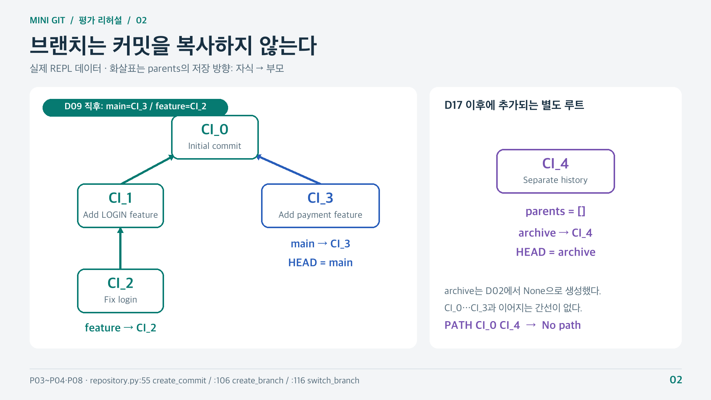

# Mini Git — B5-2

커밋 메타데이터를 메모리에서 관리하는 Python CLI 프로그램입니다. 커밋 그래프와 브랜치를 구성하고, 부모 우선 로그·최단 경로·조상 탐색·역색인 검색·직접 구현한 정렬을 제공합니다.

B5-2 과제의 필수 기능을 구현했습니다. 파일 내용 추적과 네트워크 통신은 다루지 않으며, 종료한 세션의 데이터는 저장하지 않습니다. 보너스인 Diff, Merge 명령, 여러 정렬 알고리즘의 성능 비교는 구현하지 않았습니다.

## 1. 실행 환경과 시작 방법

- **Python 3.10 이상**
- 외부 패키지 설치 불필요: Python 표준 라이브러리와 기본 자료형을 사용합니다.
- 엔트리 포인트: [main.py](main.py)

이 README와 `main.py`가 있는 `B5-2` 폴더에서 실행합니다.

```sh
python3 --version
python3 main.py
```

환경에서 Python 3.10 이상을 `python`이라는 이름으로 실행한다면 `python main.py`도 사용할 수 있습니다.

실행 후 `mini-git>` 프롬프트에 명령을 한 줄씩 입력합니다. `exit` 또는 `quit`로 종료합니다. 다시 실행하면 초기화되지 않은 새 저장소로 시작합니다.

## 2. 명령어

아래 명령은 운영체제 셸이 아닌 **`mini-git>` 안에서** 입력합니다. `<...>`는 설명용 자리표시자이므로 실제 값으로 바꿉니다.

| 명령 | 동작 |
| --- | --- |
| `INIT <user_name>` | 저장소를 초기화하고 main 브랜치·HEAD·현재 사용자를 설정합니다. |
| `BRANCH <branch_name>` | 현재 커밋을 가리키는 새 브랜치를 만듭니다. 현재 브랜치는 바뀌지 않습니다. |
| `SWITCH <branch_name>` | HEAD가 지정한 브랜치를 선택하도록 바꿉니다. |
| `COMMIT <message>` | 현재 브랜치의 커밋을 부모로 하는 새 커밋을 만들고, 브랜치 위치와 두 역색인을 갱신합니다. 커밋 ID를 출력합니다. |
| `LOG` | 저장소 전체 커밋을 부모가 자식보다 먼저 나오도록 출력합니다. |
| `LOG --sort-by=date` | 저장소 전체 커밋을 timestamp 오름차순으로 출력합니다. |
| `LOG --sort-by=author` | 저장소 전체 커밋을 작성자 이름 오름차순으로 출력합니다. |
| `PATH <commit1> <commit2>` | 부모 연결을 무방향 간선으로 보고 두 커밋 사이의 최단 경로를 출력합니다. |
| `ANCESTORS <commit_hash>` | 부모 방향으로 도달 가능한 모든 조상을 중복 없이 출력합니다. 시작 커밋 자신은 제외합니다. |
| `SEARCH <keyword>` | 키워드 역색인으로 일치하는 커밋들을 출력합니다. |
| `SEARCH --author=<name>` | 작성자 역색인으로 해당 작성자의 커밋들을 출력합니다. |
| `EXIT` / `QUIT` | 프로그램을 종료합니다. 인자는 받지 않습니다. |

### 입력 규칙

- 명령어는 대소문자를 구분하지 않습니다. 예: `init`, `INIT`, `CoMmIt`.
- 공백을 포함한 인자는 따옴표로 감쌉니다. 예: `COMMIT "Add login feature"`.
- 사용자명·메시지 등 인자 원문은 보존합니다. 작성자 검색은 이름의 대소문자까지 정확히 비교합니다.
- 옵션은 `--author=<name>`, `--sort-by=date`, `--sort-by=author` 형식으로 입력합니다. 예: `SEARCH --author="Alice Kim"`.
- 대소문자 정규화는 명령어에만 적용합니다. 옵션 이름·정렬 기준값, 브랜치 이름, 커밋 ID는 대소문자를 구분합니다. 키워드 검색의 소문자화는 별도의 검색 규칙입니다.
- 빈 입력 줄은 무시합니다. 인자 누락·초과, 빈 값, 잘못된 옵션, 닫히지 않은 따옴표 등은 오류로 안내합니다.

## 3. 순서대로 실행하는 예제

새로 실행한 REPL에서 아래 명령을 **위에서부터 한 줄씩, 한 번씩** 입력합니다. 앞서 커밋을 생성한 세션이라면 ID가 달라질 수 있으므로 종료 후 다시 시작합니다.

```text
init "Alice Kim"
branch archive
CoMmIt "Initial commit"
branch feature
switch feature
commit "Add LOGIN feature"
commit "Fix login"
switch main
commit "Add payment feature"
log
path CI_2 CI_3
ancestors CI_2
search LOGIN
search "login feature"
search --author="Alice Kim"
log --sort-by=date
log --sort-by=author
switch archive
commit "Separate history"
path CI_0 CI_4
quit
```

### 커밋 생성 결과

| ID | 부모 ID | 메시지 | 예제 종료 전 브랜치 위치 |
| --- | --- | --- | --- |
| `CI_0` | 없음 | Initial commit | — |
| `CI_1` | `CI_0` | Add LOGIN feature | — |
| `CI_2` | `CI_1` | Fix login | feature |
| `CI_3` | `CI_0` | Add payment feature | main |
| `CI_4` | 없음 | Separate history | archive, HEAD |

`archive`는 첫 커밋 전에 생성해서 `None`을 가리키는 상태로 남겨 둡니다. 나중에 이 브랜치에서 첫 커밋을 만들면 `CI_4`는 다른 이력과 연결되지 않은 루트가 됩니다. 모든 커밋의 작성자는 `Alice Kim`입니다.

### 주요 예상 결과

`CI_4`를 만들기 전 조회 결과는 다음과 같습니다.

| 입력 | 확인할 결과 |
| --- | --- |
| `log` | 현재 구현의 순서는 `CI_0, CI_3, CI_1, CI_2`입니다. `CI_0`은 `CI_1`·`CI_3`보다 먼저, `CI_1`은 `CI_2`보다 먼저 나옵니다. |
| `path CI_2 CI_3` | `Path: CI_2 -> CI_1 -> CI_0 -> CI_3` |
| `ancestors CI_2` | `CI_0`, `CI_1`의 커밋 정보 |
| `search LOGIN` | `CI_1`, `CI_2`의 커밋 정보 |
| `search "login feature"` | `CI_1`의 커밋 정보 |
| `search --author="Alice Kim"` | `CI_0`부터 `CI_3`까지 각각 한 번 |
| `log --sort-by=date` | 실제 생성 시각 오름차순. 시각이 순서대로 증가했다면 `CI_0, CI_1, CI_2, CI_3`입니다. |
| `log --sort-by=author` | 작성자가 모두 같으므로 입력 순서를 유지해 `CI_0, CI_1, CI_2, CI_3`입니다. |

`CI_4` 생성 후 `path CI_0 CI_4`는 `No path`를 출력합니다. 검색 결과의 나열 순서는 고정하지 않습니다. 로그·검색·조상 출력에는 각 커밋의 hash, author, timestamp, message가 포함되며, 시각은 실행할 때마다 달라집니다.



그림의 D 번호는 [전체 시연 안내](Docs/demo.txt)의 단계 번호입니다. 왼쪽은 `CI_3` 생성 직후, 오른쪽은 `archive`에서 `CI_4`를 생성한 상태입니다.

## 4. 세부 동작과 구현 선택

아래에는 명세의 필수 규칙과 현재 구현에서 선택한 정책을 함께 정리했습니다. PATH의 무방향·최단 간선 수·전체 문자열 사전순 규칙은 **명세의 필수 조건**입니다. 여러 토큰의 AND 검색, LOG 조회 범위, 정렬 방향·동률 처리, 반복 INIT 등의 선택 근거는 [CHECK.md의 D1~D5](Docs/CHECK.md)에 정리했습니다.

### 검색

- 메시지를 `lower().split()`으로 나눈 **토큰 전체**가 같으면 일치합니다. `LOGIN`은 `login`과 같지만, `log`는 `login`에 일치하지 않습니다.
- 공백 포함 검색어는 **AND 검색**입니다. `SEARCH "login feature"`는 두 토큰을 모두 가진 커밋을 찾습니다. 단어 순서나 연속 여부를 확인하는 구문 검색은 아닙니다.
- 작성자는 별도 색인으로 정확히 비교합니다. `Alice Kim`과 `alice kim`은 다릅니다.
- `--`로 시작하는 SEARCH 인자는 옵션으로 해석하며, `--author=` 이외의 옵션은 거부합니다.

### 로그와 경로

- 기본·정렬 LOG 모두 현재 브랜치뿐 아니라 **저장소 전체 커밋**을 대상으로 합니다.
- 기본 LOG에는 부모 우선 조건을 적용합니다. 형제 커밋 사이의 순서는 고정하지 않습니다.
- 정렬 LOG는 선택한 기준의 오름차순이며, 같은 키끼리는 정렬 함수에 전달된 입력 순서를 유지합니다. 정렬 LOG에 부모 우선 조건을 추가하지는 않습니다.
- PATH는 간선 수가 가장 적은 경로를 선택합니다. 동률이면 `hash1->hash2->...`로 만든 **전체 문자열의 사전순**이 가장 작은 경로를 선택합니다.
- 같은 ID의 PATH는 그 ID 하나를 출력합니다. 두 ID가 존재해도 연결이 없으면 `No path`, ID 자체가 없으면 오류입니다.
- ANCESTORS는 시작점 자신과 자식·형제를 제외하고 조상만 출력합니다. 현재 CLI의 출력 순서는 `commits`에 저장된 순서이며, 탐색 중 발견한 순서와는 별개입니다.

### 초기화·빈 결과·오류

- 초기화 전에는 `INIT` 이외의 저장소 명령을 거부합니다. `EXIT`·`QUIT`과 빈 줄은 초기화 없이 사용할 수 있습니다.
- 반복 INIT은 거부하고 기존 상태를 유지합니다. 별도 사용자 변경 명령은 없습니다.
- 커밋 없는 브랜치의 생성·전환을 허용합니다. 중복 브랜치 생성과 없는 브랜치 전환은 거부합니다.
- 초기화된 빈 저장소의 LOG·SEARCH, 검색 결과 없음, 루트의 ANCESTORS는 결과 줄 없이 다음 프롬프트를 표시합니다.
- 예상한 입력 오류는 `[오류]`와 원인을 출력하고 다음 입력을 받습니다. 정상 종료에는 `exit` 또는 `quit`를 사용합니다. EOF/Ctrl-D 종료는 별도로 처리하지 않습니다.

초기화된 저장소에서의 오류 예시:

```text
mini-git> switch missing
[오류] 존재하지 않는 브랜치입니다: missing
mini-git> ancestors missing
[오류] 존재하지 않는 커밋 ID입니다: missing
mini-git> log --sort-by=hash
[오류] 잘못된 정렬 기준값이 들어왔습니다.
```

## 5. 자료구조와 알고리즘

### 저장소와 커밋

| 구성 | 자료형·역할 |
| --- | --- |
| `Repository.commits` | `dict[str, Commit]`: 커밋 ID로 객체를 조회합니다. |
| `Repository.branches` | `dict[str, str \| None]`: 브랜치 이름별 현재 커밋 ID를 저장합니다. `None`은 커밋 없음입니다. |
| `Repository.head` | 현재 브랜치 이름입니다. 현재 커밋 ID는 `branches[head]`로 얻습니다. |
| `Repository.current_user` | 이후 생성할 커밋의 작성자입니다. |
| `Commit.parents` | 부모 ID 목록입니다. 부모가 없거나 여러 개인 상태를 표현할 수 있습니다. |
| `CommitIndex` | `keyword → set[ID]`, `author → set[ID]` 두 역색인입니다. |

커밋에는 `hash`, `message`, `author`, `timestamp`, `parents`를 저장합니다. `timestamp`는 `datetime.now()`로 생성합니다. ID는 `CI_0`, `CI_1`처럼 증가하는 카운터로 만들며, 기존 ID와 겹치는 후보는 건너뛰고 중복 저장도 거부합니다.

필수 COMMIT은 현재 브랜치에 커밋이 없으면 부모 없이, 있으면 해당 커밋 하나를 부모로 생성합니다. 새 ID가 기존 커밋만 부모로 참조하고 기존 부모 관계를 변경하지 않으므로 정상 CLI 생성 과정에서 **DAG(방향성 비순환 그래프)**를 유지합니다.

브랜치는 커밋 복사본이 아니라 ID를 가리키는 이름입니다. `create_branch()`는 현재 ID를 다른 이름에 연결하고, `switch_branch()`는 `head`만 바꿉니다. `create_commit()`은 커밋 저장 → 현재 브랜치 이동 → 작성자·키워드 색인 갱신 순서로 처리합니다. 내부 보조 함수 `store_commit()`은 ID 중복 검사와 저장만 담당하므로, 이 함수를 직접 호출해도 브랜치나 색인은 갱신되지 않습니다.

사이클이 있으면 어떤 커밋이 자기 자신의 조상이 되어 이력의 선후 관계를 정의할 수 없습니다. 현재 Kahn 구현에서는 사이클과 그에 의존하는 커밋이 출력 가능 상태에 도달하지 못해 결과에서 빠집니다. 정상 CLI 생성 흐름으로 사이클을 예방하며, 외부에서 직접 만든 객체에 대한 별도 사이클 검증은 구현하지 않았습니다. 내부 그래프 함수에는 부모 ID가 모두 존재하는 정상 DAG를 전달합니다.

### 기능별 처리

| 기능 | 구현 |
| --- | --- |
| 기본 LOG | [graph.py](graph.py)의 `topological_order()`가 `build_children_map()`과 `build_parent_counts()`로 준비한 표를 사용합니다. 남은 부모 수가 0인 커밋만 출력하는 Kahn 위상 정렬입니다. |
| PATH | [graph.py](graph.py)의 `build_neighbors_map()`으로 부모·자식 이웃 관계를 만들고 `build_distance_map()`으로 BFS 거리를 구합니다. `find_shortest_path()`는 도착점 기준 거리가 1 줄어드는 후보의 `best_suffix`를 비교하고 `next_step`으로 경로를 복원합니다. |
| ANCESTORS | [graph.py](graph.py)의 `find_ancestors()`가 부모 방향 BFS와 발견 집합을 사용해 모든 조상을 중복 없이 수집합니다. |
| SEARCH | [index.py](index.py)의 `CommitIndex.add_commit()`이 두 역색인을 갱신합니다. `find_by_keywords()`·`find_by_author()`가 후보 ID를 반환하고, [repository.py](repository.py)의 `search_by_keywords()`·`search_by_author()`가 해당 객체만 조회합니다. 여러 토큰은 첫 집합을 복사한 뒤 교집합으로 합칩니다. |
| 정렬 LOG | [sorting.py](sorting.py)의 `get_sort_key()`로 날짜·작성자 기준을 분리하고 `insertion_sort()`로 삽입 정렬을 직접 구현했습니다. 더 큰 키만 이동시키므로 같은 키의 상대 순서가 유지되는 안정 정렬입니다. |

Kahn 방식은 부모 하나를 출력할 때마다 그 자식들의 남은 부모 수를 1씩 줄입니다. 따라서 부모 커밋이 여러 개여도 **모든 부모가 출력된 뒤에만** 후보가 됩니다. `ready.pop()`으로 마지막 후보를 꺼내므로 형제 사이에서는 작성자·시각 순서를 보장하지 않습니다.

BFS(너비 우선 탐색)는 거리 0, 1, 2 순서로 가까운 노드부터 처리합니다. 모든 간선의 비용이 1이므로 처음 발견한 거리가 최소 간선 수입니다. 무방향 이동은 Subject.txt가 정한 규칙이며, 이 규칙으로 서로 다른 가지도 공통 조상을 거쳐 연결할 수 있습니다. 도착점에서 BFS한 거리 표는 발견 순서대로 저장되므로, `best_suffix` 계산 시 거리가 1 작은 이웃의 답이 이미 준비되어 있습니다. 후보의 전체 경로 문자열을 비교해 이웃 나열 순서와 관계없이 사전순 동률 규칙을 적용합니다.

### CLI 연결과 재사용

[main.py](main.py)의 `run_repl()`은 저장소 하나를 만들고 입력 → 파싱 → 검증·실행 → 출력 과정을 반복합니다. `parse_command_line()`은 `shlex.split()`으로 따옴표를 처리하고 명령어만 대문자로 바꿉니다. `validate_argument_count()`는 허용 명령과 인자 개수를, `parse_author_option()`·`parse_sort_option()`은 옵션 접두사와 값을 검사합니다. `execute_command()`는 이를 저장소·그래프·검색 함수에 연결합니다.

그래프 함수는 `dict[str, Commit]`을 입력받아 ID 목록·집합·거리 표를 반환하므로 REPL 없이도 검증할 수 있습니다. `build_children_map()`은 LOG와 PATH에서 공유하지만, ANCESTORS는 부모 방향만 사용하므로 별도로 탐색합니다. 출력은 `format_log()`를 기본·정렬 LOG, ANCESTORS, SEARCH가 공유하고, `format_sorted_log()`는 정렬 결과를 이 함수에 전달합니다.

그래프 전용 라이브러리와 `sorted()`·`list.sort()` 등의 표준 정렬 API를 사용하지 않습니다. docstring은 함수의 역할·반환값·상태 변화를, 주석은 자료형과 핵심 처리 이유를 설명합니다. 예를 들어 `Repository.create_commit()`의 docstring은 세 가지 상태 갱신을, `insertion_sort()`의 docstring은 원본 목록 보존을, `find_shortest_path()`의 주석은 거리 감소 조건과 전체 문자열 비교를 설명합니다.

### 복잡도와 비용

`V`는 전체 커밋 수, `E`는 부모 연결 수, `k`는 검색 결과 수, `Vᵣ`·`Eᵣ`는 조상 탐색으로 방문한 영역의 노드·간선 수, `L`은 경로 문자열의 최대 문자 수입니다. 아래 해시 연산은 평균 비용이며, 키 길이와 결과 출력 문자 수는 별도로 고려합니다.

| 처리 | 현재 구현의 비용 |
| --- | --- |
| ID로 커밋 조회 | 평균 `O(1)` |
| 기본 LOG의 순서 구성 | `O(V + E)` |
| 단일 토큰·작성자 검색 | 후보 조회와 결과 나열을 합쳐 평균 `O(1 + k)`. 여러 토큰에는 집합 복사·교집합 비용이 추가됩니다. |
| 삽입 정렬 | 평균·최악 `O(V²)`, 최선 `O(V)`. 원본 목록 복사에 추가 공간 `O(V)`를 사용합니다. |
| ANCESTORS | 여러 부모를 가진 일반 DAG에서는 리스트의 `pop(0)` 이동 비용 때문에 최악 `O(Vᵣ² + Eᵣ)`까지 커질 수 있습니다. 현재 CLI로 생성한 이력은 커밋당 부모가 최대 1개여서 큐 길이도 최대 1이고 탐색은 `O(Vᵣ + Eᵣ)`입니다. CLI 출력 순서 구성에는 전체 저장소 순회 `O(V)`가 추가됩니다. |
| PATH | 인접 관계 구성·BFS는 `O(V + E)`입니다. 전체 경로 문자열 생성·비교에는 거친 상한 `O((V + E)L)`, 문자열 저장에는 `O(VL)`을 추가로 고려합니다. |

메시지 길이가 비슷하다고 가정하면 전체 순회 검색은 매번 `V`개 메시지를 검사해 `O(V)`가 듭니다. 역색인은 토큰에 연결된 후보 `k`개만 가져오므로 `k`가 작을 때 유리합니다. `k = V`이면 결과를 모두 조회·출력하는 비용은 여전히 선형입니다. 여러 토큰의 AND 검색에서는 최종 결과 수뿐 아니라 중간 후보 집합 크기와 검색어 토큰화 비용도 봐야 합니다.

색인 갱신 비용은 새 메시지의 소문자화·공백 분리와 토큰별 ID 등록에 비례합니다. 작성자 색인에도 ID를 한 번 등록하며, 같은 단어가 반복되어도 집합이므로 ID가 중복되지 않습니다. 검색을 빠르게 하는 대신 키워드·작성자와 ID 연결을 저장하는 추가 공간을 사용합니다.

따라서 전체 PATH의 비용을 BFS 비용만으로 설명할 수는 없습니다. 긴 이력에서는 삽입 정렬과 경로 문자열 보관이, 여러 부모를 가진 입력까지 다룰 때는 조상 탐색의 큐 처리도 개선 검토 대상입니다.

## 6. 파일 구성

```text
B5-2/
├── main.py          # 엔트리 포인트, REPL, 파싱·검증, 명령 연결, 출력
├── commit.py        # Commit 메타데이터 표현
├── repository.py    # 저장소 상태, 초기화, 커밋·브랜치 관리, 검색 연결
├── graph.py         # 위상 정렬, BFS, 조상·최단 경로 탐색
├── index.py         # 작성자·키워드 역색인
├── sorting.py       # 비교 기준과 삽입 정렬
├── README.md
└── Docs/
    ├── CHECK.md         # 구현 계획과 결정 사항
    ├── Study.md         # 과제 전반의 학습 정리
    ├── Graph_Study.md   # 그래프 자료구조·알고리즘 상세 설명
    ├── cli.txt          # 순서대로 입력할 명령과 전체 문법
    ├── demo.txt         # 시연 준비·예상 결과·평가 항목 연결
    ├── script.txt       # 약 10분 발표 대본과 코드 확인 위치
    ├── script2.txt      # 대본 문단별 공부 설명서
    └── Images/          # 한국어 설명 도식
```

## 7. 시연과 검증 안내

1. [demo.txt](Docs/demo.txt)의 준비 안내를 읽습니다.
2. [cli.txt](Docs/cli.txt)의 명령을 입력 위치에 맞게 한 줄씩 실행합니다. 본 REPL과 보조 Python 인터프리터를 구분합니다.
3. [script.txt](Docs/script.txt)의 시간표·함수 위치·이미지 안내로 발표를 진행합니다.
4. 어려운 문단은 [script2.txt](Docs/script2.txt)의 같은 P 번호에서 자세히 공부합니다.

시연 자료는 실제 CLI로 생성하는 `CI_0…CI_4`와, 내부 함수에 직접 전달하는 `h0…hx` 검증 데이터를 구분합니다. 내부 검증에서는 여러 부모의 조상·로그·PATH 동률, 여러 작성자와 섞인 날짜의 정렬·검색을 확인할 수 있습니다. 이는 Merge 명령이나 사용자 변경 명령을 추가한 것이 아닙니다.

## 8. 평가의 조건 변경 질문

아래는 평가 항목 4에 대한 설계 설명입니다. 현재 프로그램의 추가 기능으로 구현한 내용은 아닙니다. 자세한 값 추적은 [학습 정리](Docs/Study.md) 14절과 [그래프 학습 안내](Docs/Graph_Study.md) 17절에서 확인할 수 있습니다.

### 4-1. 커밋 수가 10배라면

커밋당 부모 수와 메시지 길이가 비슷하다면 LOG·BFS와 전체 출력은 대략 10배 규모가 됩니다. 삽입 정렬의 평균·최악 연산량은 약 100배로 커질 수 있어, 더 큰 입력에서는 안정적인 병합 정렬을 직접 구현하는 방향을 검토할 수 있습니다. 이미 정렬된 입력의 삽입 정렬은 최선 `O(V)`이므로 항상 100배라고 할 수는 없습니다.

PATH는 현재 이웃 표를 BFS 내부와 경로 선택 전에 각각 구성하므로 한 번 만든 표를 공유할 수 있습니다. 긴 이력에서는 저장하는 경로 문자열 길이도 함께 늘어나므로 비교·보관 비용을 별도로 봅니다. 여러 부모의 조상 탐색은 PATH의 큐처럼 리스트 삭제 대신 읽기 위치를 전진시키면 `pop(0)`의 이동 비용을 없앨 수 있습니다. 현재 CLI의 단일 부모 이력에서 ANCESTORS가 무조건 제곱 시간으로 늘어나는 것은 아닙니다.

### 4-2. PATH를 부모 방향만 허용한다면

예제의 `CI_2 → CI_1 → CI_0`은 가능하지만 `CI_0 → CI_3`은 불가능해져 `PATH CI_2 CI_3`은 `No path`가 됩니다. 자식에서 부모로 갈 수 있어도 반대는 안 되므로 경로 존재 여부가 비대칭입니다.

현재처럼 도착점부터 거리를 구하려면 **거리 계산은 자식 방향 BFS**, **실제 경로 후보 선택은 부모 방향**으로 나눠야 합니다. `build_distance_map()`이 `build_children_map()`의 관계로 거리를 계산하도록 바꾸고, `find_shortest_path()`에서는 거리 표에 존재하면서 거리가 1 줄어드는 부모만 후보로 선택합니다. 도착점의 부모만 따라가면 실제로 도착점에 올 수 있는 자손들을 놓칩니다. 전체 경로 문자열의 사전순 동률 규칙은 유지합니다.

### 4-3. 작성자 정렬에 부모 우선 조건도 더한다면

부모 작성자가 `Zoe`, 자식 작성자가 `Alice`이면 전체 작성자 오름차순과 부모 우선은 충돌합니다. 부모 우선을 우선하는 정책에서는 Kahn 방식의 `ready` 후보 중 작성자가 가장 앞선 커밋을 직접 선택하고, 출력 후 자식들의 남은 부모 수를 갱신할 수 있습니다. 작성자 기준은 현재 출력 가능한 후보 사이의 우선순위입니다. 위상 정렬 후 전체를 작성자로 재정렬하거나 안정 정렬만 적용하면 부모 우선 조건을 보장할 수 없습니다.

### 4-4. 카운터 ID를 난수 ID로 바꾼다면

카운터는 같은 초기 상태·생성 순서에서 ID를 예측하기 쉬워 예제 재현과 디버깅에 유리합니다. 난수는 같은 명령에도 ID가 달라질 수 있으므로 테스트는 생성된 ID를 받아 관계를 검사하거나 난수 공급을 통제해야 합니다. 두 방식 모두 기존 ID 검사와 중복 시 재생성이 필요하며, 의사난수의 seed 고정은 재현을 돕지만 중복을 막지는 않습니다. ID 문자열이 달라지면 같은 그래프도 PATH의 사전순 동률 선택이 달라질 수 있습니다.

## 9. 평가 항목별 확인 위치

| 평가 항목 | README에서 확인할 내용 | 주요 코드 |
| --- | --- | --- |
| 1-1 초기화 | 2·3·5절: main·HEAD·사용자 | `Repository.initialize()` |
| 1-2 브랜치·커밋 | 2·3·5절: 생성·전환·부모·브랜치 갱신 | `Repository.create_branch()`·`switch_branch()`·`create_commit()` |
| 1-3 부모 우선 LOG | 3·5절: 예상 순서와 Kahn 처리 | `topological_order()` |
| 1-4 PATH | 3·4·5절: 최단 경로·No path·사전순 동률 | `find_shortest_path()` |
| 1-5 ANCESTORS | 3·4·5절: 모든 조상·중복 제외 | `find_ancestors()` |
| 1-6 검색·정렬 | 2~5절: 두 색인과 날짜·작성자 정렬 | `CommitIndex`·`insertion_sort()` |
| 2-1 상태 분리 | 5절 저장소와 커밋 | `Repository`·`Commit` |
| 2-2 ID 조회·충돌 방지 | 5절 저장소와 커밋·복잡도 | `get_commit()`·`_generate_commit_hash()`·`store_commit()` |
| 2-3 색인 갱신 | 5절 상태 갱신 순서·색인 비용 | `create_commit()`·`CommitIndex.add_commit()` |
| 2-4 그래프 재사용 | 5절 기능별 처리·CLI 연결과 재사용 | `graph.py`·`format_log()` |
| 2-5 주석·docstring | 5절 작성 기준과 실제 예 | `create_commit()`·`insertion_sort()`·`find_shortest_path()` |
| 3-1 DAG·사이클 | 5절 생성 규칙과 사이클의 영향 | `create_commit()`·`topological_order()` |
| 3-2 부모 우선 원리 | 5절 남은 부모 수와 ready | `build_parent_counts()`·`topological_order()` |
| 3-3 BFS·무방향 | 5절 최단 거리 원리와 무방향의 효과 | `build_neighbors_map()`·`build_distance_map()` |
| 3-4 정렬 복잡도·안정성 | 5절 삽입 정렬과 비용 | `get_sort_key()`·`insertion_sort()` |
| 3-5 역색인과 순회 비교 | 5절 후보 수·갱신·저장 비용 | `CommitIndex`·`Repository.search_by_keywords()` |
| 4-1 규모 증가 | 8절 4-1: 입력 형태별 병목·개선 방향 | `insertion_sort()`·`find_ancestors()`·`find_shortest_path()` |
| 4-2 부모 방향 PATH | 8절 4-2: 도달 가능성·역방향 거리 계산 | `build_distance_map()`·`find_shortest_path()` |
| 4-3 부모 우선과 작성자 | 8절 4-3: 조건 충돌·ready 후보 선택 | `topological_order()` |
| 4-4 ID 방식 변경 | 8절 4-4: 재현성·충돌·경로 동률 | `_generate_commit_hash()`·`store_commit()` |

제출·환경·라이브러리 제약은 1·5·6절에서 확인할 수 있습니다. 제출 엔트리 포인트는 `main.py` 하나이며, 이를 실행하는 데 필요한 나머지 Python 모듈도 함께 둡니다.
